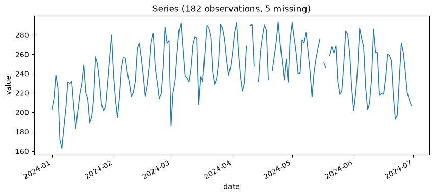
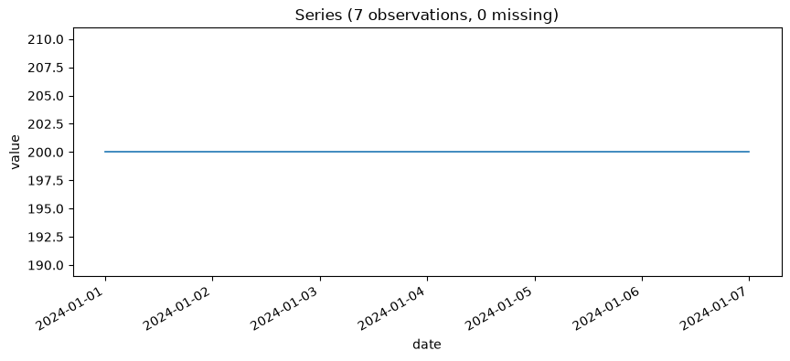

# Chapter 3: First Contact — Loading Data and Basic Statistics

The whiteboard is gone. In its place, six months of daily mojito inventory counts, logged from the Secret Lab™'s point-of-sale system and exported to a perfectly ordinary CSV: one column for the date, one column for how many mojitos were on hand at closing. This is the first real data this book touches, and it deserves a moment of respect before you run a single tool against it, because almost everything that goes wrong in forecasting goes wrong because someone skipped this moment.

## What a Time Series Actually Is

A time series is not just "a list of numbers." It's a list of numbers with two properties that matter enormously and get taken for granted constantly: the numbers are **ordered**, and each one is attached to a **specific point in time**. Shuffle a spreadsheet of quarterly sales figures and you've destroyed information a model would otherwise use. Every tool in Omen, starting right here in Layer 1, assumes this ordering is meaningful and intact.

It's also important to be precise about *what kind* of number `basic_stats` is about to hand you. The average of the 182 mojito counts you actually observed is a **sample statistic** — a fact about this specific stretch of six months. It is not the same thing as the Secret Lab™'s "true, long-run average daily mojito consumption," which is a **population** quantity you can never observe directly, only estimate. The gap between those two things is what a confidence interval is for, and it's the first real statistical idea this book teaches, on purpose, before anything harder.

## What Omen Actually Expects From Your CSV

Before loading anything of your own, here's exactly what happens to a CSV the moment you point a tool at it, rather than treating `csv_path` as a black box. Every tool in this book that takes real data — not just this chapter's `basic_stats` — funnels through the same loader, and its rules are short enough to know by heart.

A CSV needs exactly two columns that matter: one holding a date, one holding a value. By default the loader looks for columns literally named `date` and `value`; if yours are named something else — `day` and `mojitos`, say — pass `date_col="day"` and `value_col="mojitos"` and the loader renames them internally before anything else happens. Any *other* columns your CSV happens to have — a `region` column, a `notes` column, whatever your export tool bolted on — are silently dropped, not merged in or complained about. That's deliberate: Omen's tools only ever reason about one series at a time, so extra columns are simply not its problem to solve.

Two more things happen automatically, verified directly rather than assumed: **rows get sorted by date before anything else runs**, so a CSV exported in the wrong order (newest-first, or scrambled) is silently corrected, not a source of hidden bugs. Real check, real CSV with `date` deliberately out of order:

```json
[{"date": "2024-01-01", "value": 10}, {"date": "2024-01-02", "value": 12}, {"date": "2024-01-03", "value": 9}]
```

fed in as `2024-01-02, 2024-01-03, 2024-01-01` — loads back out in the correct order shown above, every time, no flag required.

Now the two ways this can go wrong, both checked for real rather than guessed at:

**Wrong column names produce a real `KeyError`, not a friendly message.** Point the loader at a CSV whose columns are actually named `day`/`count` without telling it so via `date_col`/`value_col`, and you get this, verbatim:

```
KeyError: 'date'
```

Not "column not found," not a hint about what to do next — just the raw Python exception from the point where the loader tried to reference a `date` column that was never created because the rename never happened. If you ever see this, the fix is almost always forgetting `date_col`/`value_col`, not a corrupted file.

**Date format matters more than it looks like it should, because of a default you don't control.** The loader parses dates the standard way — month-then-day, the US convention — unless a date is unambiguous enough to force a different reading (an ISO date like `2024-01-15` can only mean one thing). Feed it `01/02/2024` and it reads that as **January 2nd**, silently, whether you meant January 2nd or February 1st. Verified directly: a CSV with `01/02/2024`, `01/03/2024`, `01/04/2024` loads back as `2024-01-02`, `2024-01-03`, `2024-01-04` — every one of those parsed month-first. If your data source writes dates day-first (much of the world outside the US does), this is a real, silent misread waiting to happen — not a hypothetical. **Use ISO 8601 (`YYYY-MM-DD`) in your own CSVs whenever you have the choice**; it's the one format with no ambiguity to resolve, in either direction.

Finally: none of this requires a CSV to exist at all yet. Every tool's `csv_path` is optional — omit it (as Chapter 2 already did with `generate_synthetic_data`) and you get a synthetic series instead, generated the same deterministic way every time. Real data and synthetic data flow through the exact same downstream tools; nothing in Layers 1 through 5 treats them differently once loaded.

## Loading the Series

**Prompt:**
> Load the mojito inventory series and tell me the average daily stock level, with a confidence interval.

**What Comes Back** (a real result, from a real 182-day series generated the same way the project's own test suite generates synthetic data, with five days deliberately blanked out to represent "the incident" — more on that shortly):

```json
{
  "n_observations": 182,
  "start_date": "2024-01-01",
  "end_date": "2024-06-30",
  "inferred_frequency": "D",
  "n_missing_values": 5,
  "mean": 244.061,
  "mean_ci_lower": 239.807,
  "mean_ci_upper": 248.316,
  "confidence_level": 0.95,
  "std": 28.683,
  "min": 162.776,
  "max": 293.309
}
```

Four fields to read before you even get to the mean: `n_observations` (182 rows), `inferred_frequency` (`"D"` — daily, inferred automatically from the dates rather than assumed), `n_missing_values` (5), and the implicit date range. None of these are decoration. If `inferred_frequency` had come back something other than daily, or `null`, that would be your first sign the series has gaps or irregular spacing serious enough to matter before you trust anything downstream of it. Always look at these four fields first. It takes four seconds and it will save you from building an entire forecast on a series you misunderstood.

## How Much Do You Actually Trust That Average?

The mean daily mojito count over these six months was 244.061. The `mean_ci_lower`/`mean_ci_upper` pair — `[239.807, 248.316]` — is a 95% confidence interval on that number, built from a construction that reappears constantly for the rest of this book, always for the same reason.

The formula is the one you may already remember from an introductory statistics course: a **Student's t** interval,

```
mean ± t(0.975, df = n − 1) × (std / √n)
```

The term `std / √n` is the **standard error of the mean** — a measure of how much the sample mean itself would wobble if you repeated this six-month observation period over and over. The larger your sample, the smaller that wobble, which is why the interval tightens as `n` grows.

Here is the detail worth dwelling on, because it's a mistake that's easy to make and easy to miss: **`n` in that formula has to be the count of values you actually observed, not the number of rows in the file.** This series has 182 rows and only 177 real observations — five days were logged as blank because of "the incident" (a supply-chain dispute with a rival lab's lime cartel that this book will not get into further). If you computed the standard error using `182` instead of `177`, you would be claiming more evidence for your estimate than you actually have, and the resulting interval would come out **narrower than the data honestly supports** — a mistake that hides itself, because a narrower interval just looks like a more precise answer, not a wrong one.

Worked out with the real numbers above: using the correct non-missing count of 177 gives an interval width of about 8.51. Using the raw row count of 182 instead — the mistake — gives a width of about 8.39. That's a small difference here, because only 5 of 182 days were missing. It would not stay small on a series with real gaps — a data feed that drops a third of its days, say, during an infrastructure outage — and the direction of the error is always the same: **more missing data, silently treated as if it weren't missing, always makes the reported interval too confident.** Omen's `basic_stats` uses the correct non-missing count specifically to avoid this, and now you know why that was a deliberate choice, not an accident of which function happened to be convenient to call.

Look at those five missing days directly rather than just knowing the count. `ts-analyst__plot_series` renders the raw series with any gaps shown as real breaks in the line, not smoothed over:

**Prompt:**
> Plot the raw mojito inventory series so I can see where "the incident" actually happened.

**What Comes Back** (a real image, rendered inline):



**What It Means:** Five real breaks in the line, not five points quietly interpolated into a smooth curve — the plot shows exactly what `n_missing_values: 5` already told you, just easier to spot at a glance than a number in a JSON field. That's the whole job of every plotting tool in this book: the picture never claims anything the numbers haven't already established, it just makes an established finding faster to see. If this plot ever showed a smooth, gap-free line despite `basic_stats` reporting missing values, that would be a bug worth reporting, not a reason to trust the picture over the number.

## When There's Nothing to Be Unsure About

One more edge case worth seeing with your own eyes before this chapter moves on, because it looks like a bug the first time you encounter it and is actually the tool being scrupulously honest. Imagine a week where the mojito count genuinely never changed — a suspiciously calm week, inventory-wise:

**Prompt:**
> Run `basic_stats` on a week where the mojito count was flat at 200 every single day.

**What Comes Back** (real output):

```json
{
  "n_observations": 7,
  "n_missing_values": 0,
  "mean": 200.0,
  "mean_ci_lower": null,
  "mean_ci_upper": null,
  "confidence_level": 0.95,
  "std": 0.0
}
```

`mean_ci_lower` and `mean_ci_upper` both come back `null` — not `200.0` and `200.0`, not some fabricated hairline-width interval. This is correct. With zero observed variance, the standard error formula from the previous section divides by zero, and rather than paper over that with a made-up answer, the tool refuses to answer at all. Get comfortable seeing `null` in Omen's output and reading it as *"there is a real reason this can't be computed honestly,"* not as a bug to work around. You'll see this exact pattern — a deliberate `null` instead of a fabricated number — recur throughout this book, and every single time, it will mean the same thing.

A plot makes the same point even faster than the JSON does:



A dead-flat line. There's nothing subtle to squint at here — that's exactly why `mean_ci_lower`/`mean_ci_upper` coming back `null` is the honest answer and not a bug: a perfectly flat line has no variance for a confidence interval to be built from, and the picture makes that visually obvious in a way the number 0.0 alone doesn't quite land.

## What's Next

You now know how to load a series and ask the gentlest possible question about it: on average, what does this look like, and how sure are we? Chapter 4 asks a harder question about the same kind of data — not "what's the average," but "does this series even *have* a stable average to begin with, or is it wandering?" That's stationarity, and it's where this book stops being gentle.
