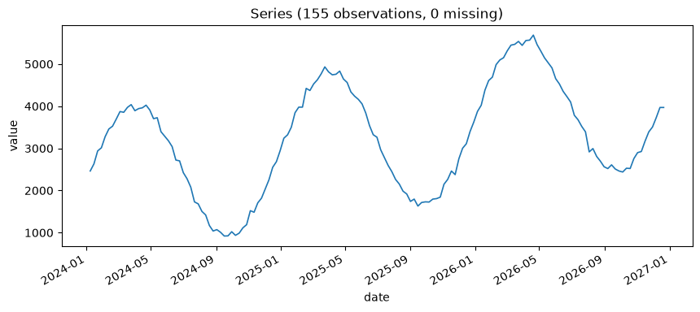
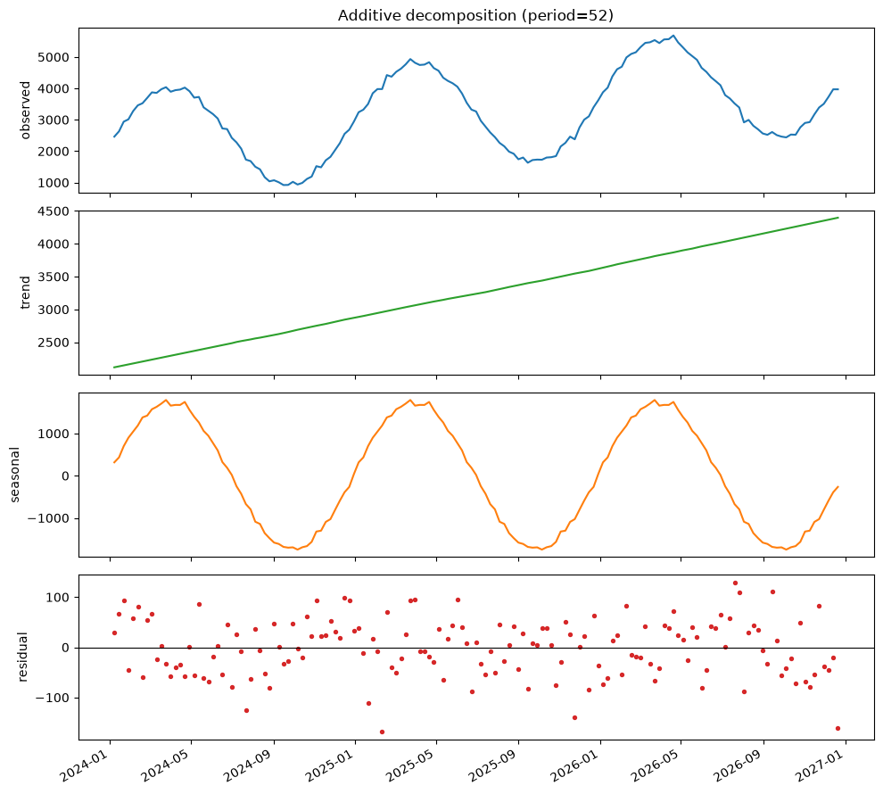
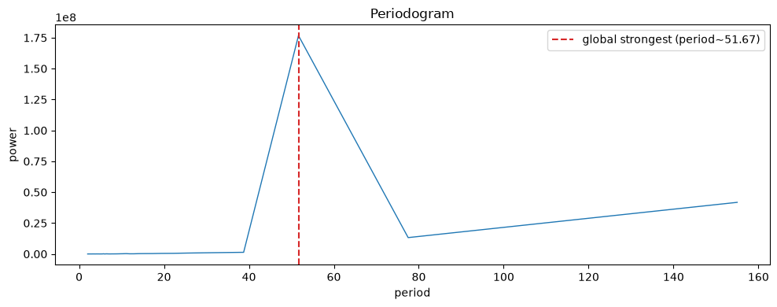
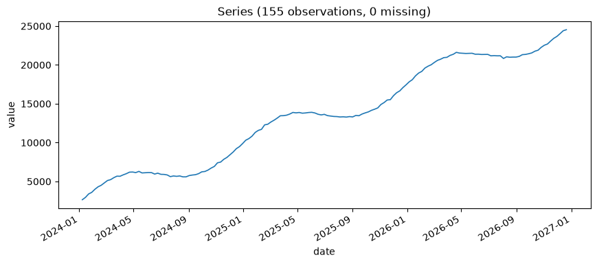
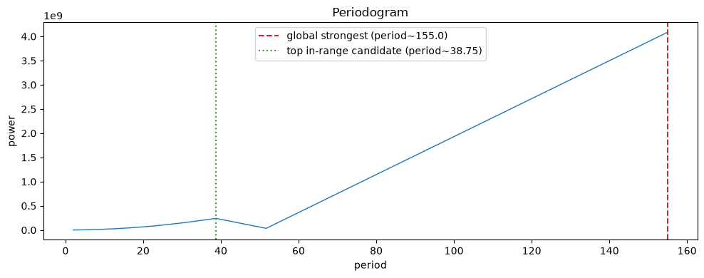

# Chapter 5: The Rhythm of Evil — Seasonality Detection & Decomposition

Every operation has a rhythm to it, whether or not anyone in charge has ever bothered to prove it. This chapter is about proving it — finding a real, repeating cycle in a series without assuming you already know its length, and decomposing a series into the pieces (trend, seasonal pattern, and whatever's left over) that explain *why* it looks the way it does.

## Meet the Henchman Costume Dry-Cleaning Account

**Henchman Costume Dry-Cleaning Bills** — weekly spend on getting the corps' public-appearance costumes properly pressed and de-scorched — swells every autumn, as Halloween-adjacent public appearances multiply and every costume in inventory needs attention at once. It also creeps up slowly year over year, for the mundane reason that the henchman roster keeps growing. Three years of weekly totals are on hand, and this chapter asks Omen to find the autumn pattern on its own, rather than being told in advance to look for a 52-week cycle.

**Prompt:**
> Load the dry-cleaning bills series and give me the basics.

**What Comes Back** (a real result, 155 weeks):

```json
{
  "n_observations": 155,
  "start_date": "2024-01-08",
  "end_date": "2026-12-21",
  "inferred_frequency": "W-MON",
  "n_missing_values": 0,
  "mean": 3246.499,
  "mean_ci_lower": 3048.601,
  "mean_ci_upper": 3444.396,
  "confidence_level": 0.95,
  "std": 1247.187,
  "min": 920.024,
  "max": 5686.286
}
```

Three full years of weekly data, no gaps, averaging around $3,250/week but ranging all the way from $920 to $5,686 — a wide enough range that it's worth actually seeing the shape behind it before assuming why:



Two things visible at a glance, both of which the rest of this chapter is about proving rather than eyeballing: a clear repeating swell roughly once a year, and a gentle overall climb underneath it. Which of those two effects is doing more of the work — the seasonal swell or the creeping trend — is exactly what decomposition and periodogram search settle next, numerically rather than by squinting at a chart.

## Additive Decomposition, First

Before searching for a period, it's worth seeing what a decomposition looks like once you already know roughly where to look. An **additive decomposition** splits a series into three pieces that are assumed to simply add together: `value = trend + seasonal + residual`. The trend component captures the slow drift; the seasonal component captures the repeating pattern at whatever period you specify; the residual is whatever's left over once both are removed — ideally not much.

**Prompt:**
> Decompose the dry-cleaning bills series assuming a 52-week seasonal period, and tell me how much of the variation each component explains.

**What Comes Back** (a real result, from 155 weeks of billing data generated with a genuine annual pattern and a modest upward trend):

```json
{
  "period_assumed": 52,
  "trend_strength": 0.9927,
  "seasonal_strength": 0.9979,
  "residual_variance_share": 0.0021,
  "interpretation": "Trend strength 0.99 and seasonal strength 1.00 on a 0-1 scale; higher means that component explains more of the variation relative to noise."
}
```

**What It Means:** Both `trend_strength` and `seasonal_strength` are on a 0–1 scale, and both came back close to 1 here — this series really is mostly explained by "it's slowly growing" plus "it swells every autumn," with only `0.0021` of the variance left over as genuine noise. That's an honest, clean result for synthetic data built with exactly those two ingredients. Real accounts-payable data won't usually look this tidy — but when it doesn't, these same two numbers tell you plainly how much of the mess is *actually* unexplained, rather than leaving you to eyeball a chart and guess.

`ts-analyst__plot_seasonal_decomposition` renders exactly this split — observed series, trend, seasonal, and residual stacked so you can see what `0.99`/`1.00`/`0.0021` actually look like, not just read them:



Look at the residual panel at the bottom: small, scattered, no visible pattern left in it — which is exactly what a `residual_variance_share` of `0.0021` should look like on a chart. If that panel still showed an obvious wave or drift, that would be a real contradiction worth chasing down — the JSON fields are what actually got computed; the plot is only a faster way to see what they already established, never a second, independent opinion.

There's a catch buried in that prompt, though, and it's the catch this chapter exists to fix: it assumed a 52-week period. Where would that number have come from, if nobody already knew to expect a Halloween pattern?

## Finding the Period Instead of Guessing It

**Prompt:**
> Find the dominant seasonal cycle in the dry-cleaning series without telling the tool to expect a 52-week period.

**What Comes Back** (real output):

```json
{
  "n_observations": 155,
  "dominant_period": 51.67,
  "dominant_period_relative_power": 0.7378,
  "dominant_period_in_reported_range": true,
  "fisher_g_statistic": 0.7378,
  "fisher_g_p_value": 0.0,
  "is_significant_periodicity": true,
  "top_candidate_periods": [
    {"period": 51.67, "relative_power": 0.7378},
    {"period": 38.75, "relative_power": 0.0056},
    {"period": 31.0,  "relative_power": 0.0042},
    {"period": 25.83, "relative_power": 0.0031},
    {"period": 22.14, "relative_power": 0.0021}
  ],
  "interpretation": "Fisher's g-test rejects the no-periodicity null (p=0.0): the dominant cycle has period ~51.67, accounting for 73.8% of total periodogram power."
}
```

**What It Means:** Without being told anything about Halloween, the tool found a dominant cycle at `51.67` weeks — as close to 52 as a periodogram built from finite, noisy weekly data is going to land — and that single candidate accounts for `73.8%` of the total spectral power in the series. The runner-up candidates are nowhere close (`0.6%` and below), so this isn't a photo finish.

`ts-analyst__plot_periodogram` draws the curve `detect_seasonality_period` searched, with the dominant period marked directly on it:



One sharp, unmistakable spike near `52`, dwarfing everything else on the curve — this is what `73.8%` of total spectral power concentrated in a single candidate actually looks like, and it's a much faster way to confirm "this isn't a photo finish" than scanning five decimal numbers in `top_candidate_periods`. Because the true dominant period here also happens to land inside the plausible range, the global-strongest marker and the top-in-range marker coincide, so the plot only shows one line — the second marker only appears distinctly once those two markers disagree, which is exactly what happens next.

The mechanism behind this is a **periodogram**: a decomposition of the series into how much of its variance is explained by cycles of every possible period, the same underlying idea as a Fourier transform applied to time series data. `is_significant_periodicity: true` comes from a formal test on top of that periodogram — **Fisher's g-test** (1929), which asks whether the single strongest candidate frequency is stronger than you'd expect from pure noise alone, not just "is it the biggest number in the list." A p-value of essentially zero here means: no, this isn't noise producing a plausible-looking peak by chance.

## The Trap: When the Trend Wins the Periodogram

Here's the gotcha this chapter promised, demonstrated rather than just asserted. The dry-cleaning series above was generated with a *modest* trend — the henchman roster growing gradually. What happens if the roster grows much faster instead — say, after an aggressive recruitment drive triples headcount over the same three years?

**Prompt:**
> Load the same dry-cleaning series, but regenerated with a 10x steeper trend, and give me the basics before we search for seasonality again.

**What Comes Back** (a real result, same 155 weeks, same seasonal pattern, only the trend changed):

```json
{
  "n_observations": 155,
  "start_date": "2024-01-08",
  "end_date": "2026-12-21",
  "inferred_frequency": "W-MON",
  "n_missing_values": 0,
  "mean": 13622.599,
  "mean_ci_lower": 12609.604,
  "mean_ci_upper": 14635.594,
  "confidence_level": 0.95,
  "std": 6384.086,
  "min": 2650.992,
  "max": 24532.788
}
```

Same 155 weeks, same underlying autumn pattern — but the mean roughly quadrupled (about $3,250/week to about $13,600/week) and the range widened dramatically (up to $24,500 now, versus $5,700 before). What that actually looks like:



Compare this directly against the plot two sections back: the same repeating autumn pattern is technically still in there, but it's now a minor ripple riding on top of a trend steep enough to dominate the picture by eye. That's the visual preview of exactly the failure mode this section is about to demonstrate numerically — a periodogram search that can't tell "a real repeating cycle" apart from "a trend so strong it looks like one very long cycle."

**What Comes Back** (real output, same series regenerated with a 10x-steeper underlying trend, searched over the same plausible seasonal range of 10–60 weeks):

```json
{
  "n_observations": 155,
  "dominant_period": 155.0,
  "dominant_period_relative_power": 0.6512,
  "dominant_period_in_reported_range": false,
  "fisher_g_statistic": 0.6512,
  "fisher_g_p_value": 0.0,
  "is_significant_periodicity": true,
  "top_candidate_periods": [
    {"period": 38.75, "relative_power": 0.0385},
    {"period": 31.0,  "relative_power": 0.025},
    {"period": 25.83, "relative_power": 0.0174},
    {"period": 22.14, "relative_power": 0.0127},
    {"period": 19.38, "relative_power": 0.0099}
  ],
  "interpretation": "Fisher's g-test rejects the no-periodicity null (p=0.0), but the single strongest frequency corresponds to period ~155.0, outside the [10, 60] range treated as plausible seasonality (likely a trend or edge-effect artifact, not true seasonality). See top_candidate_periods for the strongest candidate actually within that range."
}
```

**What It Means, and Why It Matters:** The single globally strongest frequency now has a period of `155.0` — which is not a coincidence, it's the **entire length of the series**. A strong, sustained trend behaves, spectrally, like an extremely long, slow cycle, and a periodogram cannot tell "genuinely repeats every three years" apart from "just kept going up the whole time" on the evidence of one series alone. The tool knows this is a live risk and reports `dominant_period_in_reported_range: false` plus an explicit warning in `interpretation` — this result is correctly *not* letting the trend masquerade as seasonality.

`ts-analyst__plot_periodogram` again, this time on the steep-trend series, and this is the single clearest illustration of the trap in the whole chapter:



Now the two markers split apart. The red dashed line — the global strongest frequency — sits all the way out at `155`, off at the edge where a period equal to the entire series length lives, nowhere near the modest bump the green dotted line marks inside the actual plausible range. On the clean series a moment ago, the true annual cycle *was* the tallest peak on the whole curve; here, the tallest peak on the whole curve is the trend, and the real seasonal signal is reduced to a minor, unremarkable ripple by comparison — visible proof of the "sufficiently dominant trend can corrupt a seasonality search" finding below, not just an assertion of it.

But look closely at what happened to the *rest* of the candidate list. With the gentler trend, the true ~52-week cycle stood out clearly even among the in-range candidates. With the steep trend, none of the top five in-range candidates is anywhere near 52 weeks anymore — the trend distorted the whole periodogram badly enough to bury the real signal even within the "sane" range, not just at the very top. The honest lesson here is a bit more demanding than "ignore the top result if it's out of range": a sufficiently dominant trend can corrupt a seasonality search more thoroughly than that one safeguard alone can catch. This is exactly why Chapter 4's stationarity check belongs *before* this chapter's seasonality search in any real workflow, not after it — a series this non-stationary should generally be differenced first, precisely so its trend stops competing with its seasonality for the periodogram's attention.

## What's Next

You can now find a repeating cycle in a series without assuming its length in advance, and you know exactly how that search can be led astray by a strong trend — and why. Chapter 6 stays with this same dry-cleaning data and asks a related but different question: not "does this series repeat," but "how much does it remember its own recent past," which turns out to have its own, separate trap waiting in it.
