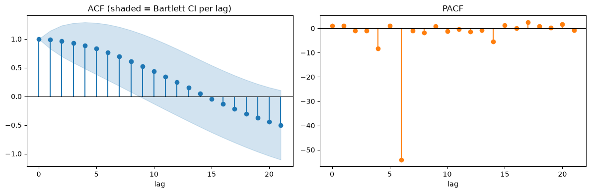

# Chapter 6: Echoes — Autocorrelation and the ACF/PACF

Chapter 5 asked whether the dry-cleaning series repeats itself on a schedule. This chapter asks a related but genuinely different question: setting the schedule aside, how much does the series simply *remember* what it was doing recently? The tool for that question is the ACF/PACF, and this chapter reuses Chapter 5's exact same dry-cleaning data specifically so you can watch it teach two different lessons back to back, using nothing you haven't already loaded.

## Two Kinds of Memory

The **autocorrelation function (ACF)** at lag *k* is simply the correlation between the series and a copy of itself shifted back *k* steps. A high ACF at lag 1 means "yesterday's value is a strong predictor of today's." The **partial autocorrelation function (PACF)** at lag *k* asks something subtler: how correlated is the series with itself *k* steps back, *after already accounting for* everything the shorter lags in between already explain? PACF is what's left over once you've given the shorter lags credit for whatever they were already going to contribute.

## The Real Result

**Prompt:**
> Which lags are statistically significant in the dry-cleaning series, and how much does the required threshold change as the lag grows?

**What Comes Back** (a real result, on the same 155-week series from Chapter 5, checked out to 20 lags):

```json
{
  "n_lags_checked": 20,
  "significance_alpha": 0.05,
  "significant_acf_lags": [
    {"lag": 1, "acf": 0.9877, "ci_lower": 0.8303, "ci_upper": 1.1451, "effect_size": 6.2739},
    {"lag": 2, "acf": 0.9653, "ci_lower": 0.6949, "ci_upper": 1.2358, "effect_size": 3.5695},
    {"lag": 3, "acf": 0.9320, "ci_lower": 0.5866, "ci_upper": 1.2774, "effect_size": 2.6980},
    {"lag": 4, "acf": 0.8872, "ci_lower": 0.4842, "ci_upper": 1.2901, "effect_size": 2.2016},
    {"lag": 5, "acf": 0.8317, "ci_lower": 0.3829, "ci_upper": 1.2805, "effect_size": 1.8533},
    {"lag": 6, "acf": 0.7671, "ci_lower": 0.2817, "ci_upper": 1.2526, "effect_size": 1.5802},
    {"lag": 7, "acf": 0.6942, "ci_lower": 0.1796, "ci_upper": 1.2089, "effect_size": 1.3490},
    {"lag": 8, "acf": 0.6135, "ci_lower": 0.0762, "ci_upper": 1.1509, "effect_size": 1.1417}
  ],
  "acf_at_lag_1": 0.9877,
  "acf_at_lag_7": 0.6942,
  "pacf_at_lag_1": 0.9941
}
```

Only 8 of the 20 lags checked made the cut. That's already useful: the series remembers its recent past strongly, but that memory does fade — somewhere between lag 8 and lag 9, it stops being distinguishable from noise. Reading `effect_size` down the list tells you *how much* margin each significant lag cleared its own bar by, not just that it cleared it — lag 1 cleared its threshold by more than 6x; lag 8 barely cleared its own, at 1.14x.

`ts-analyst__plot_acf_pacf` renders both functions side by side, with the same per-lag Bartlett bands the table above reports:



The left panel is the slow, steady staircase down that `0.9877` at lag 1 fading to `0.6942` by lag 7 already told you about — but watch the shaded band around each bar, not just the bar's own height: it visibly widens as the lag grows, exactly the "threshold isn't a straight line" finding the next section makes with numbers. A bar has to clear its *own* local band to count as significant, and by the time you reach the edge of the shaded region in this plot, several bars that still look tall in absolute terms are no longer clearing an honestly-widened bar.

The right panel — PACF — tells a more dramatic story than the JSON above even hints at, and it's worth being precise about what's actually visible rather than what you might expect to see. Lag 6's real value is `-54.05` — so far outside a valid correlation's `[-1, 1]` range that matplotlib has to stretch this panel's whole vertical axis to fit it, down to roughly `-55`. On that same stretched axis, lag 1's real, genuine spike to `0.9941` — the one number in this whole panel that actually looks like a textbook, well-behaved PACF value — gets rendered as a barely-visible sliver hugging the zero line, not a "clean spike" at all. The chaos doesn't just swamp the numbers; it visually swamps the one lag that isn't chaotic. Hold onto that image; this chapter comes back to exactly what it means later on, once the JSON confirms in numbers what's already visible here.

## Why the Threshold Isn't a Straight Line

Here's the part worth slowing down for. A common shortcut — used in a lot of textbook treatments — is to apply one flat significance threshold, `1.96/√n`, to every lag uniformly. For this series (`n = 155`), that works out to `0.1574`. Compare that to the `ci_upper − acf` half-width column from the real output above: it starts at almost exactly `0.157` for lag 1 — that's not a coincidence, the uniform formula and the correct one agree exactly at lag 1 — and then it grows: `0.270` at lag 2, `0.403` at lag 4, `0.537` at lag 8. By lag 8, the honestly-required bar is **more than three times** what the flat formula would have demanded.

This is **Bartlett's formula**, and the intuition behind why it grows is worth having, not just the fact of it: testing lag *k* is statistically like asking "does this look like more structure than an MA(k−1) model would already predict" — where an **MA(k−1)** ("moving-average") model is one built purely from the previous *k*−1 forecast errors, with no memory of the series' own past values at all (Chapter 10 covers this model family properly; for now, just hold onto "built from recent errors, not recent values") — and a series with strong short-lag autocorrelation (which this one very much has) needs a *wider* bar for anything past it to count as new information, not the same bar every time.

The practical consequence of ignoring this is worse than you might expect. Extending the same comparison out to all 20 checked lags, using the flat `0.157` threshold everywhere instead of the correct growing one:

| Lag range | Correct (Bartlett) verdict | Flat-threshold verdict |
|---|---|---|
| 1–8 | Significant | Significant (agrees) |
| 9–12 | **Not** significant | Significant (false positive) |
| 13–16 | Not significant | Not significant (agrees) |
| 17–20 | **Not** significant | Significant (false positive) |

A flat threshold doesn't just get one lag's ranking wrong — on this series, it would have called *twice as many* lags "significant" as actually are, wrongly flagging lags 9 through 12 and 17 through 20 as real structure. If you were reading this as "which lagged values are worth feeding a model as features" (a question Chapter 11 asks in earnest), a flat threshold would have handed you eight extra, spurious features to sort out.

## Centered on the Estimate, Not on Zero

One more subtlety before this chapter moves on, because it trips people up specifically when they try to recompute significance by hand from raw interval bounds instead of reading `effect_size` directly. Look at lag 1's interval again: `ci_lower: 0.8303`, `ci_upper: 1.1451`, straddling `acf: 0.9877`. That interval is centered on the *estimated ACF value itself* — `0.9877 − 0.1574` and `0.9877 + 0.1574` — not on zero. If you tried to judge significance by checking whether zero falls outside `[ci_lower, ci_upper]`, you'd get the same answer here (it does, safely), but that's incidental to how strong this particular signal is — the correct test is always whether the interval's own *half-width*, not its raw bounds, exceeds the ACF magnitude. `effect_size` already does this division for you; it's there specifically so you never have to reason about which comparison is the right one.

## What This Shape Is Telling You

Step back from the individual lags and look at the overall picture: the ACF doesn't drop off quickly. It decays slowly and smoothly from `0.99` at lag 1 down through `0.61` at lag 8, and — checked further out, past where this series stops being "significant" by the formal test — it keeps drifting down rather than snapping to zero or oscillating in a clean seasonal spike pattern. That slow, smooth decay is itself a diagnostic: it's the classic signature of a series that hasn't been freed of its own trend yet — the same kind of persistence Chapter 4 found on Death-Ray Revenue, though worth being precise that Chapter 4 never actually tested *this* series. It's worth checking directly rather than assuming the family resemblance settles it.

**Prompt:**
> The ACF's slow decay looks like the same non-stationary signature Chapter 4 found on a different series. Don't assume it — run `check_stationarity` on this dry-cleaning series directly.

**What Comes Back** (a real result, `check_stationarity` run on this exact dry-cleaning series for the first time):

```json
{
  "adf_p_value": 0.293, "adf_is_likely_stationary": false,
  "kpss_p_value": 0.1, "kpss_is_likely_stationary": true,
  "interpretation": "ADF and KPSS disagree: ADF fails to reject a unit root (non-stationary) but KPSS fails to reject stationarity. This combination is often inconclusive -- both tests can have limited power on short or borderline series; treat stationarity as genuinely uncertain rather than picking one test's verdict over the other."
}
```

**What It Means:** Not the clean, one-sided verdict the ACF's slow decay alone might have led you to expect. ADF and KPSS genuinely disagree here — exactly Chapter 4's "investigate further" case, not its "both tests agree" one. That's a real, useful tension to sit with rather than smooth over: the ACF's shape is telling you something true about this series' persistence, and the formal stationarity tests are telling you something true about the genuine uncertainty in classifying that persistence definitively. Neither reading cancels the other out — a series can show strong, slowly-decaying autocorrelation *and* have an ambiguous formal stationarity verdict at the same time, and both facts are worth carrying forward rather than picking whichever one tells a tidier story.

It gets more interesting — and more honest — when you go looking for the PACF's usual companion signature. For a textbook **AR(1)** ("autoregressive") process — one where each value is predicted from just the single value one step before it, the mirror image of the MA model above — PACF is supposed to spike hard at lag 1 and then cut off cleanly. Lag 1 does spike hard here (`0.9941`) — but computing PACF further out on this particular series returns values that are not just uninformative, they're **mathematically nonsensical**: partial autocorrelations outside the valid `[-1, 1]` range entirely, exactly the wild, out-of-range swinging the PACF panel of the earlier plot already showed you. That's not a bug in the reasoning, and it doesn't mean the tool is broken. It means the underlying recursion PACF estimation depends on becomes numerically unstable on a series this persistent — a third, independent diagnostic (after the ACF's slow decay and the ADF/KPSS disagreement itself) all pointing at the same underlying property, even without a single tidy up-or-down verdict to hang it on. Differencing this series first (the technique Chapter 10 covers properly) doesn't just make SARIMA's job easier; it's what makes a clean, trustworthy PACF reading possible at all.

## What's Next

You've now watched the same series produce a genuinely ambiguous formal stationarity verdict (this chapter), a trend confound in its seasonality detection (Chapter 5), and a slowly-decaying ACF with a numerically broken PACF beyond lag 1 (also this chapter) — three diagnostics, three different angles, no single one of them settling the question alone. Chapter 7 asks a different kind of question about a series — not "does it have structure," but "did something specific and unusual happen to it," and it's where anomaly and changepoint detection finally enter the book.
