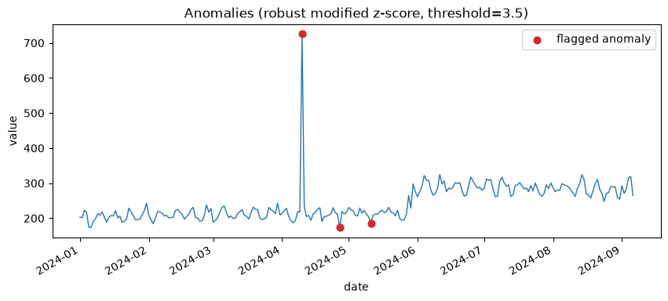
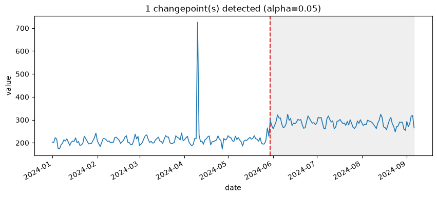

# Chapter 7: Spikes and Regime Changes — Anomaly and Changepoint Detection

Not everything worth flagging in a series is a pattern. Sometimes something just goes wrong for one day. Sometimes something goes wrong and *stays* wrong, permanently, from that day forward. Those are different problems, they call for different responses, and — this is the chapter's real point — they need genuinely different tools, because a tool built for one will not reliably catch the other.

## Meet the Power Bill

**Secret Lab™ Power Consumption**, tracked daily in kilowatt-hours, has two separate incidents buried in it this chapter is going to find. Once, the death ray misfired during a routine test and drew an enormous, one-day surge of power before the safety interlocks caught it. Later, entirely unrelated, the Lab annexed a rival operation's smaller lair — along with all of its power-hungry legacy equipment — and baseline consumption has run permanently higher ever since. One of these is a spike. The other is a regime change. This chapter's two detector families exist because those are not the same thing.

## Finding the Spike, Two Ways

**Prompt:**
> Does the power consumption series have any anomalous days? Check with both the standard and the robust detector — do they agree?

**What Comes Back** (real results, from a 250-day series with a real +500 single-day spike injected on top of otherwise ordinary consumption around a base level of ~200):

```json
// detect_anomalies_zscore
{
  "z_threshold": 3.0,
  "n_anomalies_flagged": 1,
  "max_abs_z_score": 3.457,
  "anomalies": [
    {"date": "2024-04-10", "value": 725.731, "z_score": 3.457}
  ]
}

// detect_anomalies_robust_zscore
{
  "z_threshold": 3.5,
  "n_anomalies_flagged": 3,
  "max_abs_modified_z_score": 27.887,
  "anomalies": [
    {"date": "2024-04-10", "value": 725.731, "modified_z_score": 27.887},
    {"date": "2024-04-27", "value": 173.001, "modified_z_score": -4.368},
    {"date": "2024-05-11", "value": 185.918, "modified_z_score": -3.744}
  ]
}
```

**What It Means:** Both detectors caught April 10th — a jump from a ~200-level baseline to `725.731` is not subtle. But look at the actual *score* each one assigned to the exact same day: the standard rolling z-score gave it `3.457`, which barely clears its own default threshold of `3.0`. For a spike this obvious, that number should feel much too close for comfort. The robust, MAD-based version scored the identical day at `27.887` — nearly eight times higher, and not remotely close to its own threshold.

## Self-Dilution: The Bug Hiding in the Rolling Window

Here's why the two scores are so different, and it's worth understanding the mechanism, not just the number. The standard z-score detector computes a *rolling* mean and standard deviation — a local baseline that updates as it moves through the series — and scores each point against its own local window. The problem: that rolling window, by construction, **includes the anomalous point itself**. A single +500 spike sitting inside a 14-point window doesn't just stand out against that window — it also drags the window's own standard deviation upward, since standard deviation is sensitive to exactly the kind of extreme value it's being asked to detect. The detector's yardstick stretches to accommodate the very thing it's measuring, and the reported z-score comes out smaller than the spike actually deserves. This is **self-dilution**, and it's a real, structural weakness of mean/standard-deviation-based detection methods generically, not a quirk of this one implementation.

The robust version swaps in a **rolling median and median absolute deviation (MAD)** instead — the "modified z-score" approach from Iglewicz & Hoya (1993). Medians and MADs barely move when a single extreme point sits inside their window; the median of fourteen mostly ordinary values doesn't budge just because one of them is wild. The yardstick stays honest, and the same spike that scored a lukewarm `3.46` under the classic method scores an unambiguous `27.89` under the robust one.

This isn't a story about the robust detector being free of tradeoffs, though — worth being honest about the rest of that output. It also flagged two *additional* days (April 27th and May 11th) that the classic detector never mentioned, both well short of the spike's own magnitude. Being less bluntable by outliers cuts both ways: a MAD-based local baseline can also be tight enough, during an ordinarily quiet stretch, to flag an ordinary bit of noise as unusual by comparison. This isn't a flaw to paper over — it's the actual, honest cost of the fix, and deciding whether that cost is acceptable for a given series is a real judgment call, not something either detector makes for you.

`ts-analyst__plot_anomalies` marks the robust detector's three flagged points directly on the series:



One point towers over everything else on the chart — April 10th, exactly as dramatic to the eye as its `27.887` score suggested it should be. The other two flagged points, by contrast, barely register visually against the ordinary noise around them; they're real, correctly-flagged departures from a tight local baseline, but nothing about them would catch your attention if the plot weren't marking them for you. That gap between "obviously anomalous by eye" and "anomalous by the numbers, but easy to miss without help" is exactly the honest tradeoff the paragraph above just described, made visible rather than just argued.

## Finding the Regime Change

Neither anomaly detector, notice, said anything about the Lab's newly annexed equipment permanently raising the baseline. That's not a miss — it's not what they were built to look for. For that, this chapter needs a genuinely different tool.

**Prompt:**
> Separately, has the series' baseline level permanently shifted at any point? What's the effect size of that shift?

**What Comes Back** (real result, same series):

```json
{
  "n_observations": 250,
  "alpha": 0.05,
  "n_changepoints_found": 1,
  "changepoints": [
    {
      "date": "2024-05-30",
      "mean_before": 214.14,
      "mean_after": 286.995,
      "cohens_d_effect_size": 2.0174,
      "cusum_statistic": 11.1147,
      "p_value": 0.002
    }
  ],
  "interpretation": "1 structural break(s) found: 2024-05-30 (mean 214.14 -> 286.995, Cohen's d=2.0174, p=0.002)"
}
```

**What It Means:** One real changepoint, found exactly where the shift actually happened — May 30th, not April 10th. The mean level moved from `214.14` to `286.995`, a Cohen's d of `2.0` (a large effect by conventional standards), with a p-value of `0.002`. Just as importantly: the detector did **not** flag April 10th's spike as a changepoint. That single wild day, however dramatic in isolation, didn't represent a lasting shift in the series' baseline — it was gone the next day — and a good changepoint detector needs to see that difference clearly, not treat every large deviation as evidence of the same kind of event.

`ts-analyst__plot_changepoints` shades the series on either side of the real break:



This is the same series as the anomaly plot above, and it's worth looking at both side by side: April 10th's spike, so visually dominant in the first plot, doesn't even get a mark here — correctly, since it's a single point, not a lasting shift. What this plot marks instead is something the anomaly plot couldn't have shown you at all: two visibly different baselines, a calmer one on the left of the dashed line and a noticeably higher one on the right, the kind of shift that's genuinely hard to spot day-to-day but obvious once a full stretch on either side is shaded and compared.

Under the hood, this uses **binary segmentation** with a standardized CUSUM (cumulative sum) statistic to locate candidate breaks, and a **permutation test** — rather than a closed-form formula — to assign each candidate a p-value. A permutation test works by repeatedly shuffling the series' own values, recomputing the same CUSUM statistic on each shuffle, and asking how often a shuffle produces something at least as extreme as what the real, unshuffled data produced. It's exact by construction (no distributional assumption to get subtly wrong), at the cost of needing many resamples — Omen runs 500 by default, seeded for reproducibility, so re-running this exact check gives you the exact same p-value back every time.

One limitation worth carrying forward honestly, even though this example only found a single break: each changepoint's p-value is a **local** test — valid for that one split, evaluated within whatever segment of the series existed at that point in the search. It is *not* a global significance guarantee across the *entire set* of changepoints a search reports, if it finds more than one. Treat `alpha` and `max_changepoints` as tuning knobs for how aggressively to search, not as controlling an exact, provable false-discovery rate across everything found. This is a standard, well-documented limitation of binary segmentation as a technique — not unique to this implementation, and not a reason to distrust any individual reported break, just a reason not to over-claim about the collection of them as a whole.

## Two Questions, Not One

Put the two tool families side by side and the chapter's real point should be obvious from the data itself, not just asserted: the anomaly detectors correctly ignored May 30th (nothing about that single day looked unusual against its *local* neighborhood — the shift only becomes visible zoomed out), and the changepoint detector correctly ignored April 10th (one wild day that didn't persist isn't a regime change, however large it was in the moment). Neither tool is a weaker version of the other. They're answering different questions, and a series can easily contain an honest example of both at once, the way this one does.

## What's Next

Part II is finished. You now know how to check whether a series is stable, find its real seasonal rhythm, read its autocorrelation structure honestly, and separate one-off spikes from lasting regime changes — everything Omen's own `ts-analyst` layer can tell you before a single model gets fit. Part III starts fitting models for real, and it starts, appropriately, with the model you're not allowed to skip: the naive baseline every fancier candidate has to actually beat.
