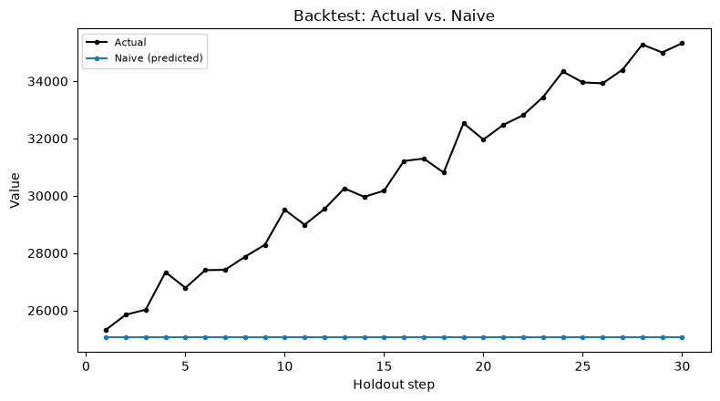
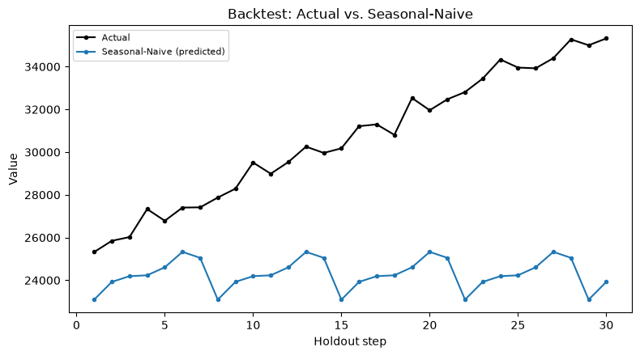

# Chapter 8: The Floor Is Naive — Baselines You Must Beat

Part III starts fitting models. Before any of them get to be interesting, they have to clear the lowest possible bar first: can they beat a forecast that requires no modeling at all? This chapter is about taking that bar seriously instead of treating it as a formality to skip past on the way to something fancier.

## Two Ways to Be Trivial

A **naive** forecast just repeats the last observed value, forever. A **seasonal-naive** forecast repeats the value from one full seasonal cycle back, tiled across the forecast horizon. Neither one involves fitting anything — no parameters, no optimization, nothing that could go subtly wrong in the way a real model can. That's the entire point: whatever Chapters 9 through 11 build has to out-perform *this*, or it isn't earning its complexity.

## Backtesting Death-Ray Revenue's Floor

**Prompt:**
> Fit naive and seasonal-naive baselines on the death-ray revenue series. Which one wins, and by how much?

**What Comes Back** (a real result, on the same 70-week Death-Ray Revenue series from Chapter 4, holding out the most recent 30 weeks):

```json
{
  "naive": {
    "mae": 5598.32, "rmse": 6358.17, "mape_pct": 17.46,
    "mape_pct_ci_lower": 14.53, "mape_pct_ci_upper": 20.28,
    "mape_points_excluded_near_zero": 0
  },
  "seasonal_naive": {
    "seasonal_period_assumed": 7,
    "mae": 6358.16, "rmse": 7044.12, "mape_pct": 19.98,
    "mape_pct_ci_lower": 17.17, "mape_pct_ci_upper": 22.82,
    "mape_points_excluded_near_zero": 0
  }
}
```

**What It Means:** Flat naive wins here — `17.46%` MAPE against seasonal-naive's `19.98%` — and it's worth pausing on *why*, because it's not simply "flat naive is generally better." `seasonal_period_assumed: 7` was never actually established for this series. Nothing in Chapter 4's work on Death-Ray Revenue found a 7-week cycle — that's just the tool's default. Chapter 1 already told you the rule this violates: carry Layer 1's findings forward into Layer 2 rather than accepting an unexamined default. Repeating "whatever happened 7 weeks ago" on a series that's mostly just trending upward means anchoring your forecast to an older, systematically *lower* point — worse than anchoring to the most recent value, precisely because the series keeps climbing. An unjustified seasonal assumption didn't just fail to help here; it actively hurt.

`ts-forecaster__plot_backtest`, run on each baseline's real holdout arrays from the result above, makes the shape of that mistake visible instead of just numerical:





Flat naive's line sits flush against the last training value and never moves — it doesn't need to be right about the future, just steady, and steady turns out to be the better bet here. Seasonal-naive's line visibly saws up and down, repeating the same seven-day pattern from a week that was already lower than where the series has climbed to by the time each forecast point lands — you can *see* the systematic under-prediction the prose above described, not just read the MAPE gap that resulted from it.

## The Bootstrap CI Is Doing More Work Than It Looks Like

Look again at the two MAPE confidence intervals: naive's is `[14.53%, 20.28%]`; seasonal-naive's is `[17.17%, 22.82%]`. The point estimates (`17.46` vs `19.98`) look like a clean, decisive win. The intervals tell a less tidy story — they overlap substantially, across almost the entire `17.17`–`20.28` range. A 30-point holdout's error estimate has real sampling uncertainty of its own, and these two intervals overlapping is a warning sign worth taking seriously: it's not yet safe to conclude, from this alone, that naive would *reliably* beat seasonal-naive on a different 30-week stretch of similar data.

It's worth being precise about what this observation does and doesn't prove. Eyeballing whether two independent confidence intervals overlap is a common shortcut, and it's a conservative one — it's entirely possible for two models to be significantly different by a proper statistical test while their individual CIs still overlap a little, because a test built on the *paired* differences between two models' errors on the *same* holdout points is more powerful than comparing two separate intervals ever can be. This chapter is deliberately planting a question it doesn't answer yet: is naive's win here real, or is it noise? Chapter 12 introduces the actual tool for answering that properly — a paired significance test, not a squint at two overlapping bars.

## When MAPE Looks Fine and MAE Is Screaming

One more real scenario worth seeing before this chapter moves on, because it's a failure mode a quick glance at MAPE alone will not catch. Imagine a stretch where death-ray bookings didn't just slow down — they stopped entirely for a month, after a rival's legal team sent a strongly-worded cease-and-desist over a licensing dispute.

**What Comes Back** (real result, on a shorter supplementary series with four consecutive weeks of exactly `$0` revenue sitting inside a 10-week holdout):

```json
{
  "mae": 11063.64,
  "mape_pct": 7.48,
  "mape_points_excluded_near_zero": 4,
  "holdout_actuals": [25328.55, 25050.80, 0.0, 0.0, 0.0, 0.0, 26785.01, 27402.90, 27413.40, 27871.53]
}
```

**What It Means:** `mape_pct` came back at a deceptively reassuring `7.48%` — because MAPE is undefined for an actual value of exactly zero (you can't divide by zero), so the tool excludes those four points from the calculation entirely, and reports exactly how many it dropped rather than silently producing a number computed over fewer points than you think it was. Look at `mae` instead: `11,063.64`, dramatically worse than anything in the earlier, well-behaved backtest. That's not a contradiction between the two metrics — it's each one doing exactly what it's defined to do. MAE has no trouble scoring a forecast of "roughly $25,000" against an actual of "$0" as a huge miss, because it just measures absolute distance. MAPE, built around a *relative* error, has nothing meaningful to say about a point where the denominator is zero, and rather than fabricate an answer, it steps aside — loudly, via `mape_points_excluded_near_zero`, not quietly. Reading MAPE alone here would have missed the story entirely. This is exactly why Omen reports all three metrics together rather than picking a favorite.

## What's Next

The floor is set, and you now know not to trust it blindly either — an unexamined default nearly won this round on borrowed credibility from a seasonal assumption nobody actually checked. Chapter 9 fits the first real model this book covers: exponential smoothing, and the first prediction interval you'll see that isn't just "the last value, forever."
