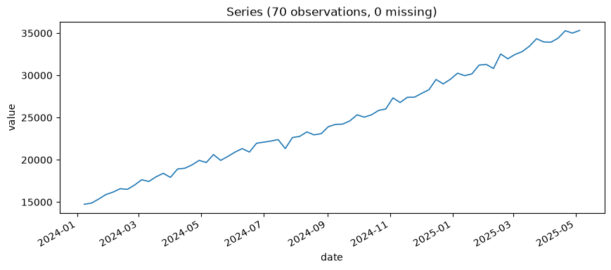
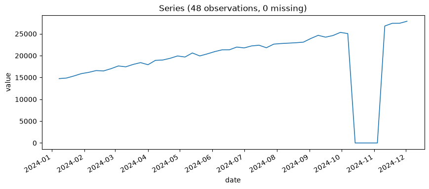

# Chapter 8: The Floor Is Naive — Baselines You Must Beat

Part III starts fitting models. Before any of them get to be interesting, they have to clear the lowest possible bar first: can they beat a forecast that requires no modeling at all? This chapter is about taking that bar seriously instead of treating it as a formality to skip past on the way to something fancier.

## Two Ways to Be Trivial

A **naive** forecast just repeats the last observed value, forever. A **seasonal-naive** forecast repeats the value from one full seasonal cycle back, tiled across the forecast horizon. Neither one involves fitting anything — no parameters, no optimization, nothing that could go subtly wrong in the way a real model can. That's the entire point: whatever Chapters 9 through 11 build has to out-perform *this*, or it isn't earning its complexity.

## Why Anything Gets Held Back At All

Here's why one exists in the first place, since every backtest in this book depends on it. A model's error on the exact data it was fit to is not a trustworthy estimate of how well it will do on data it hasn't seen — a flexible enough model can fit the noise in its own training data almost as easily as it fits real signal, and fitting noise doesn't help it predict anything new; it just makes the in-sample error look better than it deserves to. The only honest way to find out how a model actually generalizes is to score it on data it never touched while being fit.

That's what a **train/test split** (also called a **holdout**) is: divide the series into a **training set** the model is allowed to learn from, and a **test set** — held back, untouched during fitting — that exists purely to be predicted against afterward and scored. `n_train` and `n_test` below aren't arbitrary bookkeeping; `n_train` is every data point the model gets to see and fit its parameters to, `n_test` is every data point it has to predict blind, with its own fitted parameters already locked in.

One thing makes a time series' split different from a typical machine-learning train/test split, and it matters enough to say plainly: the split has to be **chronological**, never a random shuffle. `train_range` ends before `test_range` begins, with no overlap, because the entire premise of forecasting is inferring the future from the past — training on data that includes points *after* the holdout, even mixed in at random, would let a model implicitly peek at information it wouldn't have had in the real, working scenario this backtest is meant to simulate: standing at some week `X`, with weeks `1` through `X` already observed, being asked what week `X+1` through `X+30` will look like. A backtest is that scenario, replayed honestly on data where you happen to already know the real answer, so you can check how close the guess actually came.

## Check the Split Before You Fit Anything

Confirm what this specific holdout size actually carves the series into, rather than trusting the number silently — by asking the tool that does no fitting at all, just reports the dates.

**Prompt:**
> Before fitting anything, show me the train/test split for the death-ray revenue series with a 30-week holdout.

**What Comes Back** (a real result, same 70-week Death-Ray Revenue series, `holdout_size=30`):

```json
{
  "n_total": 70,
  "n_train": 40,
  "n_test": 30,
  "train_range": ["2024-01-08", "2024-10-07"],
  "test_range": ["2024-10-14", "2025-05-05"]
}
```

**What It Means:** `ts-forecaster__holdout_split_summary` doesn't fit or backtest anything — it just answers "what would `holdout_size=30` actually carve this series into," so a bad assumption gets caught before it's buried inside a fitted model's output. Here it confirms the split is sane: 40 training weeks, a full 30-week test window, no overlap, dates in the expected order. On a shorter series, or a holdout size that's too large relative to the data, this is where you'd catch it — an empty or tiny `train_range`, or a `n_train` too small to fit anything meaningful — before spending a real model fit finding out the hard way. This is the SKILL's own recommended first move, before `fit_naive_baselines` or anything else in this chapter runs.

Here's a reminder of the shape of what's actually being split, since Chapter 4 is a few chapters back now:



The same climb from about $15,000 to about $35,000 over roughly a year and a half. Everything this chapter backtests holds out the most recent 30 of those weeks — the flattest, highest-value stretch on the right of this same picture — and asks two trivial baselines to predict it.

## Backtesting Death-Ray Revenue's Floor

**Prompt:**
> Fit naive and seasonal-naive baselines on the death-ray revenue series. Which one wins, and by how much?

**What Comes Back** (a real result, on the same 70-week Death-Ray Revenue series from Chapter 4, holding out the most recent 30 weeks):

```json
{
  "naive": {
    "mae": 5598.32, "rmse": 6358.17, "mape_pct": 17.46,
    "mape_pct_ci_lower": 14.53, "mape_pct_ci_upper": 20.28,
    "mape_points_excluded_near_zero": 0
  },
  "seasonal_naive": {
    "seasonal_period_assumed": 7,
    "mae": 6358.16, "rmse": 7044.12, "mape_pct": 19.98,
    "mape_pct_ci_lower": 17.17, "mape_pct_ci_upper": 22.82,
    "mape_points_excluded_near_zero": 0
  }
}
```

**What It Means:** Three error metrics show up in every backtest result in this book from here on, so here's what each one actually measures before comparing them: **MAE** (mean absolute error) is the average size of a miss, in the series' own units — dollars, here. **RMSE** (root mean squared error) measures the same thing but squares each miss before averaging, so a few large misses drag it up more than MAE, which treats every miss's size proportionally. **MAPE** (mean absolute percentage error) is MAE expressed as a percentage of the actual value instead of raw units, which is what makes it the one comparable across series measured in wildly different scales.

Flat naive wins here — `17.46%` MAPE against seasonal-naive's `19.98%` — and the reason matters, because it's not simply "flat naive is generally better." `seasonal_period_assumed: 7` was never actually established for this series. Nothing in Chapter 4's work on Death-Ray Revenue found a 7-week cycle — that's just the tool's default. Chapter 1 already told you the rule this violates: carry Layer 1's findings forward into Layer 2 rather than accepting an unexamined default. Repeating "whatever happened 7 weeks ago" on a series that's mostly just trending upward means anchoring your forecast to an older, systematically *lower* point — worse than anchoring to the most recent value, precisely because the series keeps climbing. An unjustified seasonal assumption didn't just fail to help here; it actively hurt.

`ts-forecaster__plot_backtest`, run on each baseline's real holdout arrays from the result above, makes the shape of that mistake visible instead of just numerical:


Flat naive's line sits flush against the last training value and never moves — it doesn't need to be right about the future, just steady, and steady turns out to be the better bet here. Seasonal-naive's line visibly saws up and down, repeating the same seven-day pattern from a week that was already lower than where the series has climbed to by the time each forecast point lands — you can *see* the systematic under-prediction the prose above described, not just read the MAPE gap that resulted from it.

## The Bootstrap CI Is Doing More Work Than It Looks Like

Look again at the two MAPE confidence intervals: naive's is `[14.53%, 20.28%]`; seasonal-naive's is `[17.17%, 22.82%]`. The point estimates (`17.46` vs `19.98`) look like a clean, decisive win. The intervals tell a less tidy story — they overlap substantially, across almost the entire `17.17`–`20.28` range. A 30-point holdout's error estimate has real sampling uncertainty of its own, and these two intervals overlapping is a warning sign worth taking seriously: it's not yet safe to conclude, from this alone, that naive would *reliably* beat seasonal-naive on a different 30-week stretch of similar data.

This observation proves less than it might look like it does. Eyeballing whether two independent confidence intervals overlap is a common shortcut, and it's a conservative one — it's entirely possible for two models to be significantly different by a proper statistical test while their individual CIs still overlap a little, because a test built on the *paired* differences between two models' errors on the *same* holdout points is more powerful than comparing two separate intervals ever can be. This chapter is deliberately planting a question it doesn't answer yet: is naive's win here real, or is it noise? Chapter 12 introduces the actual tool for answering that properly — a paired significance test, not a squint at two overlapping bars.

## When MAPE Looks Fine and MAE Is Screaming

One more real scenario before this chapter moves on: a failure mode a quick glance at MAPE alone will not catch. Imagine a stretch where death-ray bookings didn't just slow down — they stopped entirely for a month, after a rival's legal team sent a strongly-worded cease-and-desist over a licensing dispute.

**Prompt:**
> Load this shorter supplementary revenue series -- the one with the licensing freeze -- and give me the basics.

**What Comes Back** (a real result, 48 weeks):

```json
{
  "n_observations": 48,
  "start_date": "2024-01-08",
  "end_date": "2024-12-02",
  "inferred_frequency": "W-MON",
  "n_missing_values": 0,
  "mean": 19160.882,
  "mean_ci_lower": 17198.421,
  "mean_ci_upper": 21123.343,
  "confidence_level": 0.95,
  "std": 6758.491,
  "min": 0.0,
  "max": 27871.526
}
```

A shorter, supplementary series — not the same 70-week Death-Ray Revenue from the rest of this chapter, a separate 48-week one built specifically for this scenario. The `min` of exactly `0.0` is the tell:



Four consecutive weeks flat at zero, near the end of an otherwise ordinary trending series — visible proof the freeze isn't a data artifact or a single dropped value, but a real, sustained stretch of no revenue at all sitting inside what's about to become the backtest holdout.

**What Comes Back** (real result, on a shorter supplementary series with four consecutive weeks of exactly `$0` revenue sitting inside a 10-week holdout):

```json
{
  "mae": 11063.64,
  "mape_pct": 7.48,
  "mape_points_excluded_near_zero": 4,
  "holdout_actuals": [25328.55, 25050.80, 0.0, 0.0, 0.0, 0.0, 26785.01, 27402.90, 27413.40, 27871.53]
}
```

**What It Means:** `mape_pct` came back at a deceptively reassuring `7.48%` — because MAPE is undefined for an actual value of exactly zero (you can't divide by zero), so the tool excludes those four points from the calculation entirely, and reports how many it dropped rather than silently producing a number computed over fewer points than you think it was. Look at `mae` instead: `11,063.64`, dramatically worse than anything in the earlier, well-behaved backtest. That's not a contradiction between the two metrics — it's each one doing what it's defined to do. MAE has no trouble scoring a forecast of "roughly $25,000" against an actual of "$0" as a huge miss, because it just measures absolute distance. MAPE, built around a *relative* error, has nothing meaningful to say about a point where the denominator is zero, and rather than fabricate an answer, it steps aside — loudly, via `mape_points_excluded_near_zero`, not quietly. Reading MAPE alone here would have missed the story entirely. This is why Omen reports all three metrics together rather than picking a favorite.

## What's Next

The floor is set, and you now know not to trust it blindly either — an unexamined default nearly won this round on borrowed credibility from a seasonal assumption nobody actually checked. Chapter 9 fits the first real model this book covers: exponential smoothing, and the first prediction interval you'll see that isn't just "the last value, forever."
