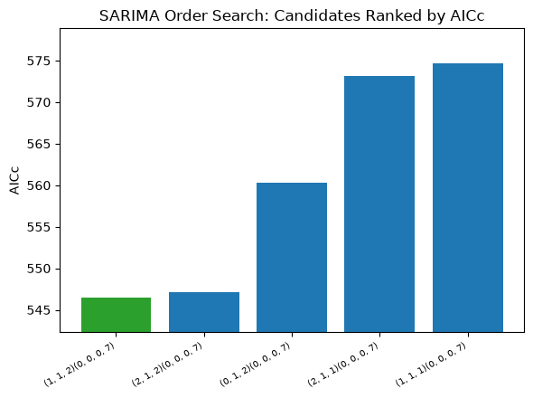

# Chapter 10: SARIMA and the Order-Selection Ritual

SARIMA is where the notation this book has been building toward finally gets a name: `(p, d, q)(P, D, Q, s)`. Every one of those letters is something you've already reasoned about in an earlier chapter, whether or not it had this particular name at the time. This chapter connects them properly, fits the model on Death-Ray Revenue, and shows — using a real search, not a hypothetical one — why an automated order search deserves your skepticism even when it looks clean.

## The Notation, Traced Back to Chapters You've Already Read

`d` and seasonal `D` are **differencing orders** — how many times the series (or its seasonal cycle) needs to be differenced before it behaves like a stationary series. This is exactly Chapter 4's question, not a new one. `p` and `q` are the **autoregressive** and **moving-average** orders — how many lagged values, and how many lagged forecast errors, the model uses to build each prediction. Their seasonal counterparts, `P` and `Q`, do the same thing at the seasonal period `s`. Chapter 6's ACF/PACF work is exactly what a real order-selection process should be reasoning from for `p` and `q` — though it's worth being honest that Chapter 6 examined the dry-cleaning series, not Death-Ray Revenue specifically. This chapter doesn't have a from-scratch ACF/PACF reading for *this* series to lean on, which is precisely the gap `search_sarima_orders` exists to help with later in the chapter — a tool, not a substitute for having done the reading.

## Grounding `d`, Guessing Everything Else

**Prompt:**
> Given that Chapter 4 found this series non-stationary with `d=1`, fit SARIMA using that differencing order rather than guessing.

**What Comes Back** (real result — `d=1` grounded in Chapter 4's finding, `p=1`, `q=1` as an unexamined starting guess, seasonal terms disabled since no seasonal cycle was ever established for this series):

```json
{
  "params": {"order": [1, 1, 1], "seasonal_order": [0, 0, 0, 2]},
  "aic": 573.99, "aicc": 574.66, "bic": 578.82,
  "backtest_metrics": {"mape_pct": 15.08, "mape_pct_ci_lower": 12.46, "mape_pct_ci_upper": 17.65},
  "backtest_interval_coverage": {"empirical_coverage_pct": 33.33, "well_calibrated": false},
  "residual_diagnostics": {"residuals_look_like_white_noise": true, "ljung_box_p_value": 0.83}
}
```

**What It Means:** One more fit-quality field shows up here for the first time: `bic`, the **Bayesian Information Criterion** — like `aic`/`aicc` from Chapter 9, it rewards a model for fitting well and penalizes it for having more parameters, but with a steeper penalty per parameter that grows with the sample size. The three don't have to agree, and here they do — `573.99`, `574.66`, `578.82` all move together — so this chapter reasons from AIC/AICc alone and doesn't lean on BIC separately.

Grounding `d` correctly wasn't enough on its own — a guessed `(1,1,1)` barely beats naive's 17.46% MAPE from Chapter 8, badly underperforms Chapter 9's ETS fits, and its interval is just as miscalibrated as ETS's worst attempt. Getting one letter of `(p,d,q)` right doesn't get you a good model; `p` and `q` still matter, and guessing them isn't meaningfully different from guessing `d` would have been.

## Letting a Search Do the Guessing, Then Checking Its Work

**Prompt:**
> Run an advisory order search with `d=1` held fixed. Does the best-ranked candidate actually have clean residuals, or does it just have the best AICc?

**What Comes Back** (real result, searching `p` and `q` from 0–2 with `d=1` fixed and seasonal terms disabled, exactly as reasoned above):

```json
{
  "n_combinations_tried": 9,
  "top_candidates": [
    {"order": [1,1,2], "aicc": 546.52, "backtest_metrics": {"mape_pct": 7.228}, "residuals_look_like_white_noise": true},
    {"order": [2,1,2], "aicc": 547.12, "backtest_metrics": {"mape_pct": 7.490}, "residuals_look_like_white_noise": true},
    {"order": [0,1,2], "aicc": 560.33, "backtest_metrics": {"mape_pct": 16.781}, "residuals_look_like_white_noise": true},
    {"order": [2,1,1], "aicc": 573.18, "backtest_metrics": {"mape_pct": 14.769}, "residuals_look_like_white_noise": true},
    {"order": [1,1,1], "aicc": 574.66, "backtest_metrics": {"mape_pct": 15.083}, "residuals_look_like_white_noise": true}
  ],
  "interpretation": "Best by AICc: order=[1, 1, 2]... This is a shortlist, not a final answer -- verify residual diagnostics on whichever candidate you pick with a direct fit_sarima call, and consider diebold_mariano_test if the top two candidates are close."
}
```

**What It Means:** A search over just 9 combinations found `(1,1,2)`, cutting MAPE from the guessed model's `15.08%` down to `7.23%` — a real, substantial improvement, and every single top candidate here happens to pass its own residual check. This chapter isn't going to pretend otherwise: it doesn't always work out this cleanly. Elsewhere in this project's own history, a best-AICc candidate from this exact search tool has come back with genuinely broken residuals — ranked first by the numbers, structurally deficient underneath them. That it didn't happen on this particular search is exactly why the check has to run *every* time regardless of how the last one went, not just when something looks suspicious. A residual check you only bother running when you already expect trouble isn't really a check.

Look instead at what this search's own `interpretation` flagged on its own: the top two candidates, `(1,1,2)` at AICc `546.52` and `(2,1,2)` at AICc `547.12`, are separated by less than a single point — a margin the tool itself calls out as close enough to warrant a proper significance test rather than trusting the ranking blind. That's Chapter 12's job, not this chapter's, and this search result is exactly the kind of situation it exists for.

`ts-forecaster__plot_search_sarima_orders`, run on this exact real search result, makes that margin obvious at a glance rather than something you have to notice by comparing decimals:



The y-axis here is deliberately zoomed to the candidates' actual spread rather than starting at zero — starting at zero would visually flatten exactly the near-tie this plot exists to surface. The gap between `(1,1,2)` and the third-place `(0,1,2)` is unmistakable; the gap between first and second place barely registers as a gap at all.

## Verifying the Winner Properly

`search_sarima_orders` deliberately doesn't crown a winner and hand it to you pre-approved — its own top candidates report only a stripped-down `backtest_metrics` summary, not the full picture. Confirming the choice means calling `fit_sarima` directly on it.

**What Comes Back** (real result, `order=[1,1,2]`, `seasonal_order=[0,0,0,2]`):

```json
{
  "aic": 545.38, "aicc": 546.52, "bic": 551.71,
  "backtest_metrics": {"mape_pct": 7.228},
  "backtest_interval_coverage": {"empirical_coverage_pct": 30.0, "well_calibrated": false},
  "residual_diagnostics": {"residuals_look_like_white_noise": true, "ljung_box_p_value": 0.846}
}
```

**What It Means:** Residuals check out cleanly, confirming the search's own claim. But look at `backtest_interval_coverage`: `30.0%`, against a nominal `95%` — badly miscalibrated, and if anything slightly *worse* than the guessed model's own broken interval from earlier in this chapter. This is worth sitting with, because it's the same finding Chapter 9 already made once, through a completely different mechanism. SARIMA's confidence interval is **analytic** — derived directly from the fitted state-space model's own math, no simulation involved, unlike ETS's simulated paths. And it's *still* untrustworthy here. Point accuracy and interval trustworthiness are genuinely separate questions, and neither the model family nor the interval-construction method (simulated versus analytic) determines which one you get for free. A model can nail its forecast and still not know how uncertain it should be about that forecast — and the only way to find out is to check, every time, regardless of which method built the interval.

## Why the Search Doesn't Touch `d`

One design choice in `search_sarima_orders` is worth calling out explicitly, because it's easy to wish the tool did more than it does: `d` and seasonal `D` are never searched — only supplied, fixed, by whoever calls it. That's not a missing feature. This entire book's design, going back to Chapter 1, is built around the idea that an agent reasons about a series from what earlier diagnostic layers actually found, not from blind search. Letting a grid search freely pick its own differencing order would mean it could quietly re-decide "is this series stationary" on numerical grounds alone — overriding Chapter 4's actual statistical test with whatever combination happens to minimize AICc, for reasons that might have nothing to do with the real data-generating process. `p`, `q`, `P`, and `Q` are a reasonable space for a bounded search to explore. Whether the series needs differencing in the first place is not — that's a question with a real, testable answer this book already taught you how to get honestly.

## What's Next

Death-Ray Revenue now has two genuinely competitive models — Chapter 9's multiplicative ETS and this chapter's `(1,1,2)` SARIMA — and a real, open question about whether their similar-looking error numbers represent a meaningfully different model or just noise. Chapter 11 takes a detour before answering that: a completely different approach to the same forecasting problem, built on gradient-boosted trees instead of either family covered so far.
