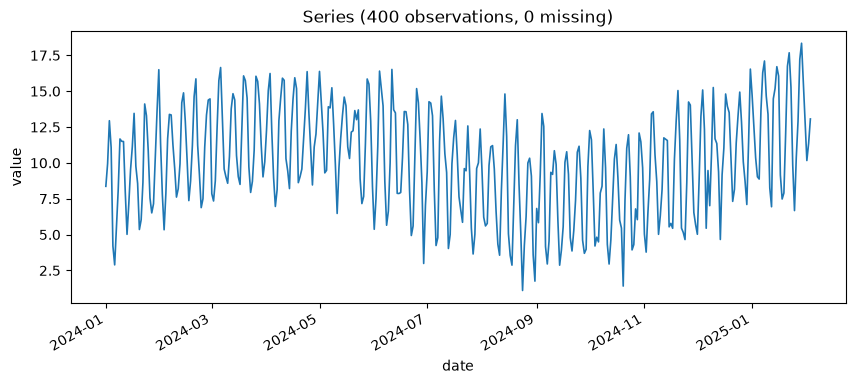

# Chapter 11: Teaching Trees to Predict the Future — Gradient Boosted Trees

Everything so far in Part III has fit a model built specifically for time series. This chapter fits something else entirely: an ordinary gradient-boosted-trees regressor, the same kind of model you'd reach for on a spreadsheet of loan applications, aimed at a forecasting problem by turning the calendar itself into features. It works better than that description makes it sound — and it comes with the single most important caveat in this entire book, one Chapter 14 is going to insist on revisiting.

## Meet the Minion Overtime Log

**Minion Overtime Hours**, logged daily, has two real drivers behind it: a strong day-of-week pattern (weekend shifts need actual minion oversight the automated systems can't be fully trusted with alone), and a real, if subtler, year-end scramble as annual villainy quotas start looming. 400 days of history are on hand — enough to give a tree-based model something to actually learn from.

**Prompt:**
> Load the minion overtime series and give me the basics.

**What Comes Back** (a real result, 400 days):

```json
{
  "n_observations": 400,
  "start_date": "2024-01-01",
  "end_date": "2025-02-03",
  "inferred_frequency": "D",
  "n_missing_values": 0,
  "mean": 10.063,
  "mean_ci_lower": 9.705,
  "mean_ci_upper": 10.421,
  "confidence_level": 0.95,
  "std": 3.641,
  "min": 1.103,
  "max": 18.343
}
```

Just over a year of daily hours, averaging about 10 per day, ranging from just over 1 to just over 18. A mean and a range don't say anything about *why* it swings that widely, though — which is what this chapter's two claimed drivers predict, and what the plot below should already hint at before a single feature gets engineered:



A dense, regular weekly sawtooth is visible even at this zoomed-out scale — the day-of-week pattern this chapter's about to ask a tree model to find on its own. Whether the subtler year-end effect is *also* visible by eye here, or whether it's the kind of signal that needs the feature-importance numbers below to surface at all, is worth deciding for yourself before reading on.

## Forecasting as a Feature-Engineering Problem

Gradient-boosted trees don't know anything about time. To use one for forecasting, the series has to be reframed as an ordinary supervised learning table: for each day, build features describing what's already known (the value 1, 7, and 14 days ago; the day of the week; the calendar month; a running time index), and set the target to that day's actual value. The model then learns, the same way it would for any other tabular regression problem, which of those features actually help predict the target.

**Prompt:**
> Fit gradient-boosted trees on the minion overtime series and show me which features matter most.

**What Comes Back** (a real result, from 400 days of overtime hours):

```json
{
  "backtest_metrics": {"mae": 1.63, "rmse": 1.82, "mape_pct": 13.00},
  "feature_importances": {
    "lag_1": 0.0377,
    "lag_7": 0.6764,
    "lag_14": 0.1486,
    "day_of_week": 0.0855,
    "month": 0.0074,
    "time_index": 0.0444
  }
}
```

**What It Means:** `lag_7` dominates, by a wide margin — `0.676` of the model's total importance, versus `0.038` for yesterday's value (`lag_1`). That's the day-of-week pattern showing up exactly where you'd expect: knowing what happened on the *same day of the week* one cycle ago turns out to be far more informative than knowing what happened yesterday, precisely because "yesterday" was a different day of the week with its own different typical level. `lag_14` (two weeks back, the same weekday again) picks up a meaningful share too (`0.149`), reinforcing the same pattern a second time. `day_of_week` itself contributes a modest amount on top (`0.086`) — plausibly because the lag features already captured most of that signal directly, leaving less additional information for the raw day-of-week label to add.

## A Real Surprise in the Month Feature

Here's the part that wasn't planned, and it teaches something real. The overtime data was built with a genuine year-end effect baked in — noticeably higher overtime as Q4 approaches. And yet `month`'s importance came back at a nearly negligible `0.0074`.

Here's the reason, not just the fact of it: `month` is a **categorical** feature with exactly twelve possible values, and the actual underlying pattern is a **smooth, continuous** annual cycle that doesn't respect calendar-month boundaries at all. A tree can only split on "is the month equal to (or less than) some specific integer" — a blunt, discrete way to approximate a smooth curve, and a poor one when most of the signal's variation happens gradually rather than in sharp jumps between named months. Compare this to Chapter 5's `detect_seasonality_period`, which found a real annual cycle in the dry-cleaning series directly, as a *continuous* period, via a periodogram — a fundamentally more precise tool for this kind of question. Handing a smooth seasonal signal to a tree model via a coarse twelve-bucket calendar feature and expecting it to show up clearly in feature importance is asking the wrong tool to do a job a different chapter's tool already does properly.

Here's the actual remedy, not just the diagnosis: the standard fix for handing a smooth calendar cycle to a tree model is a **cyclical encoding** -- two continuous features, `sin(2*pi*day_of_year/365.25)` and `cos(2*pi*day_of_year/365.25)`, instead of one twelve-bucket integer. That pair of features, unlike a raw month number, has no artificial jump between December and January and lets a tree split on smooth, continuous position-in-year the same way it already splits on `time_index`. `fit_gradient_boosted_trees` doesn't build one internally -- its own feature set is fixed to lags, `day_of_week`, `month`, and `time_index` -- so this is a fix you'd apply yourself upstream of the tool, not a flag it exposes; but the shape of the actual answer matters too, not just why the current feature underperforms.

Here's what feature importance is, and is not, telling you in general. A high importance score for `lag_7` means the model found that feature genuinely useful for reducing prediction error during training — it does **not** mean "same-weekday-last-week *causes* today's overtime total." It's a statement about predictive usefulness within this specific model, not a causal claim about the underlying process. For a series this dominated by a repeating weekly pattern, that distinction happens not to matter much practically — but it's the kind of distinction that matters enormously on a series where it's less obvious, and that's a habit to keep regardless.

## The Caveat That Matters More Than Any Number Above

Now the part of this chapter everything else was building toward. Notice what's conspicuously absent from the JSON above: no `backtest_interval_coverage`, no residual diagnostics. And notice this, included automatically, unprompted, in the tool's own output:

> *"This backtest uses true lagged values at each holdout point (one-step-ahead), not a recursive multi-step forecast. It is an easier evaluation setting than the multi-step forecasts ETS/SARIMA are scored on above — do not compare error numbers directly without accounting for this."*

Read that again slowly, because it's the single most important sentence in this chapter. Every backtest point this model was scored against used the **real, true** values for `lag_1`, `lag_7`, and `lag_14` — not the model's own earlier predictions. Chapter 9's ETS and Chapter 10's SARIMA were both evaluated on a genuine multi-step forecast, where step 20 has to stand on the shoulders of steps 1 through 19's own predicted values, errors compounding as they go. This model has never once been asked to do that. Its `13.00%` MAPE and Chapter 10's `7.23%` SARIMA MAPE are not directly comparable numbers, even though they're sitting in the same units, measured the same way, on the same series — because they were earned under genuinely different rules. A model that looks competitive here can turn out to compound errors badly the moment it actually has to forecast several steps ahead using its own earlier guesses instead of the truth. Chapter 14 puts this model into exactly that harder, more honest situation, and remember, when you get there, that this chapter's numbers didn't have to survive it.

## What's Next

Three real candidates now exist for Death-Ray-Revenue-style forecasting problems in general, and this chapter's own series in particular: ETS, SARIMA, and gradient-boosted trees, each evaluated under its own rules. Chapter 12 finally builds the tool this book has been setting up since Chapter 8's overlapping confidence intervals and Chapter 10's razor-thin AICc margin — a formal, paired statistical test for whether two models' forecasts are actually, meaningfully different, or just noise wearing different numbers.
