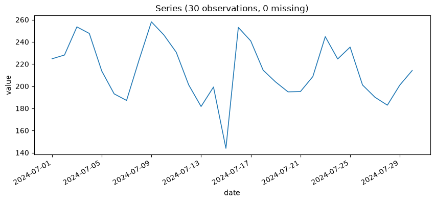
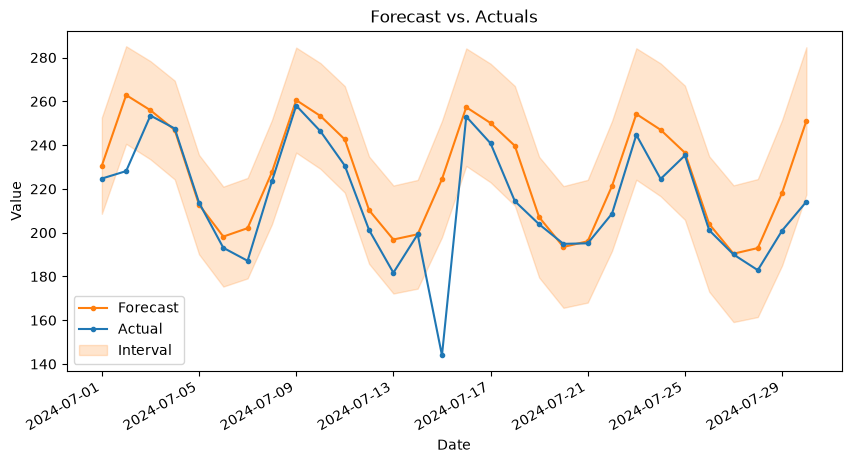
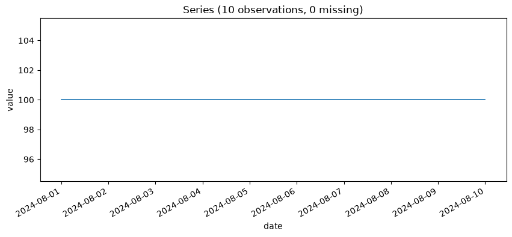

# Chapter 16: Watching the Watchtower — Monitoring a Forecast in Production

A deployed forecast is a claim about the future, and Chapter 14 shipped one for Secret Lab™ Mojito Inventory a month ago: SARIMA, 30 days out, default order, real prediction intervals attached. A month has now passed. Real observations exist for every one of those 30 forecasted dates. This chapter opens `ts-monitor` for the first time and asks the only question that actually matters once a forecast has had time to be tested by reality: was it right?

**Prompt:**
> Load the real July observations -- the month that's now elapsed since deployment -- and give me the basics before comparing anything.

**What Comes Back** (a real result, 30 days):

```json
{
  "n_observations": 30,
  "start_date": "2024-07-01",
  "end_date": "2024-07-30",
  "inferred_frequency": "D",
  "n_missing_values": 0,
  "mean": 214.563,
  "mean_ci_lower": 204.68,
  "mean_ci_upper": 224.447,
  "confidence_level": 0.95,
  "std": 26.469,
  "min": 143.95,
  "max": 258.062
}
```

Thirty real days, no gaps, averaging around 215 units. On its own, plotted raw, before any comparison against the deployed forecast:



One dip stands out immediately, well before any forecast-comparison tool gets involved — worth keeping in mind as this chapter's checkpoints unfold, since it's the same event the residual-outlier check below is going to name explicitly.

## The First Checkpoint, Ten Days In

**Prompt:**
> Compare the mojito forecast against the first 10 days of real observations. How wide is the confidence interval on the elapsed error, and does the prediction interval look calibrated so far?

**What Comes Back** (a real result, matching the first 10 forecasted dates against real July observations):

```json
{
  "n_dates_compared": 10,
  "backtest_style_metrics": {"mae": 7.8371, "mape_pct": 3.5813, "mape_pct_ci_lower": 1.3118, "mape_pct_ci_upper": 6.6206},
  "interval_coverage": {
    "empirical_coverage_pct": 90.0,
    "empirical_coverage_ci_lower": 59.58,
    "empirical_coverage_ci_upper": 98.21,
    "nominal_confidence_pct": 95.0,
    "well_calibrated": true,
    "interpretation": "90.0% of realized actuals fell within their prediction interval (Wilson score 95% CI: [59.58%, 98.21%], n=10)... treat the calibration verdict as provisional until more observations accumulate."
  }
}
```

**What It Means:** `90.0%` coverage against a `95%` nominal target sounds like a genuinely reassuring early result — close, well within the tool's own tolerance, `well_calibrated: true`. Now look at the Wilson score interval sitting right next to it: `[59.58%, 98.21%]`, a span of nearly `39` points, on a point estimate computed from just `10` matched days. That range comfortably includes values that would mean this interval is badly too narrow. The point estimate isn't wrong to report — it's the best available read on the data so far — but treating `90%` as a settled verdict this early would mean ignoring exactly the uncertainty this Wilson score interval exists to surface. Ten points is not very many points, and the interval says so honestly, even while the headline number says "looks fine."

## The Full Month, Including the Party

Mid-month, an unplanned "product testing event" — a party — drew down the lab's mojito inventory far faster than any ordinary day. The question this section exists to answer: does that one unusual day quietly inflate the whole month's error figure into looking like a systematic forecasting problem, or can the tool actually tell the difference?

**Prompt:**
> Compare the full month against the SARIMA forecast. Is the elapsed error being driven by one unusual day, or is it spread evenly?

**What Comes Back** (a real result, all 30 matched dates):

```json
{
  "backtest_style_metrics": {"mae": 11.766, "mape_pct": 6.1136, "mape_pct_ci_lower": 3.2197, "mape_pct_ci_upper": 9.9851},
  "interval_coverage": {"empirical_coverage_pct": 90.0, "empirical_coverage_ci_lower": 74.38, "empirical_coverage_ci_upper": 96.54, "well_calibrated": true},
  "residual_outliers": {
    "z_threshold": 3.5,
    "flagged_dates": ["2024-07-15", "2024-07-30"],
    "max_abs_modified_z_score": 9.0473,
    "metrics_excluding_outliers": {"mae": 8.4117, "rmse": 11.8748, "mape_pct": 3.9367},
    "interpretation": "2 of 30 matched date(s) flagged as residual outliers..."
  }
}
```

**What It Means, Part One:** Notice the coverage CI first — `[74.38%, 96.54%]` now, versus `[59.58%, 98.21%]` at the 10-day checkpoint. Three times as much data narrowed the same `90%` point estimate's confidence interval by more than half. That's the honest payoff of waiting for more observations before treating a calibration read as settled, made concrete rather than asserted.

**What It Means, Part Two:** The residual-outlier check found July 15 — the party — exactly as expected: a residual of `-80.52`, a modified z-score of `-9.05`, wildly past the `3.5` threshold. Excluding it (and one other flagged day) drops MAPE from `6.11%` to `3.94%`, confirming this month's aggregate error is, in large part, one unusual day, not a steadily wrong model. That's the real answer to this section's question — and it's the *right* kind of finding to act on differently than a systematic miss: a single anomalous demand event isn't evidence SARIMA needs retraining.

**What It Means, Part Three — the Finding Worth Not Skipping Past:** The outlier check flagged a *second* day too: July 30, the very last day of the elapsed horizon, with a residual of `-36.93` and a modified z-score of `-3.72` — just past the threshold, nowhere near as dramatic as the party day's `-9.05`. There's no known event behind this one. It's simply the forecast's error having grown, unremarkably, toward the far end of the horizon — the ordinary kind of miss a fixed 30-day-out forecast is expected to accumulate, that happened to land just past this particular statistical threshold. This is worth sitting with: not every flagged date comes with a tidy explanation attached, and treating "flagged as an outlier" as synonymous with "found the special event" would have been a mistake here. `metrics_excluding_outliers` excludes *both* days, which is exactly correct mechanically — but reading that improved `3.94%` MAPE as "the model is fine except for one known incident" would overstate the case. Some of what's being excluded is just an unremarkable single low draw over toward the edge of the horizon, not a second incident requiring its own explanation.

**Prompt:**
> Plot the full month's forecast against what actually happened.

**What Comes Back** (a real render, `ts-monitor__plot_forecast_vs_actuals` on the same forecast and the full month of real observations):



**What It Means:** The party is visible without reading a single number — a single point punching clean through the interval band on July 15, exactly where the `-9.05` modified z-score said it would be. The July 30 miss is there too, real but genuinely smaller, a modest gap between the actual line and the forecast rather than a dramatic break — visually consistent with Part Three's point that not every flagged day deserves equal alarm. This is the honest use case for a plot like this one: it can't tell you a residual is `9.05` modified-z-scores away from the median, but it can tell you, at a glance, that two specific days are worth asking about and the other twenty-eight aren't — which is exactly the triage step before you go read the exact numbers, not a replacement for reading them.

## A Real, Deliberately Constructed Failure Mode

The residual-outlier check's own documentation names a specific, non-hypothetical limitation: if half or more of a month's residuals are *exactly* identical, the median absolute deviation the check is built on can collapse to exactly zero — and when it does, every point's modified z-score collapses to zero along with it, regardless of how extreme any single remaining residual actually is. Worth confirming this really happens rather than taking the docstring's word for it.

**Prompt:**
> Load the constructed 10-day actuals series for this edge case and give me the basics.

**What Comes Back** (a real result):

```json
{
  "n_observations": 10,
  "start_date": "2024-08-01",
  "end_date": "2024-08-10",
  "inferred_frequency": "D",
  "n_missing_values": 0,
  "mean": 100.0,
  "mean_ci_lower": null,
  "mean_ci_upper": null,
  "confidence_level": 0.95,
  "std": 0.0,
  "min": 100.0,
  "max": 100.0
}
```

`std: 0.0`, `mean_ci_lower`/`mean_ci_upper` both `null` — the same honest zero-variance signature Chapter 3's flat mojito week produced. This series is a dead-flat line at exactly 100:



The *actuals* being perfectly flat isn't itself the failure mode — it's what's about to happen once these are compared against a forecast that's mostly, but not entirely, exactly right on top of them. That comparison is next.

**What Comes Back** (a real result, on a constructed 10-point case: six residuals of exactly `0`, plus residuals of `5`, `-5`, `-3`, and one genuinely enormous miss of `100`):

```json
{
  "flagged_dates": [],
  "max_abs_modified_z_score": 0.0,
  "per_point": ["... six points with residual 0.0, modified_z_score 0.0 ...",
                {"residual": 100.0, "modified_z_score": 0.0}],
  "interpretation": "No residual outliers flagged -- the aggregate error above isn't being driven by a small number of unusual days."
}
```

**What It Means:** The `100`-unit miss — by a wide margin the largest residual in this constructed set — gets a modified z-score of exactly `0.0`, identical to six perfectly accurate days. Not close to the threshold. Not a borderline case. Zero. And the tool's own generated interpretation, in this specific scenario, states plainly that the aggregate error "isn't being driven by a small number of unusual days" — which is, in this constructed example, false. This isn't a bug to paper over; it's a documented, real mathematical consequence of using the median and MAD for robustness (Chapter 7 already introduced this same tradeoff, from the other direction, for `detect_anomalies_robust_zscore`) against a distribution where the majority of values are identical. A forecast that's suspiciously exact on most days — worth being suspicious of in its own right — is exactly the condition under which this particular safety net has a real, documented hole in it.

## What's Next

This month's story had a happy ending: a real anomaly, correctly distinguished (mostly) from ordinary forecast drift, no reason yet to distrust the deployed SARIMA model itself. Not every drifted forecast will be this legible. Chapter 17 asks what happens when the shift isn't a single loud day but a slow, structural change in the series itself — and where this project's own drift-detection tooling has blind spots of its own.
