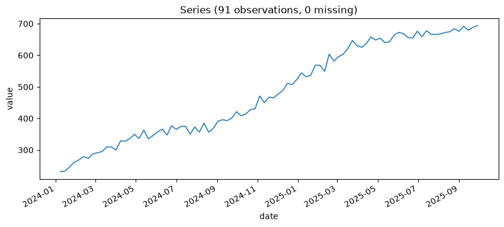
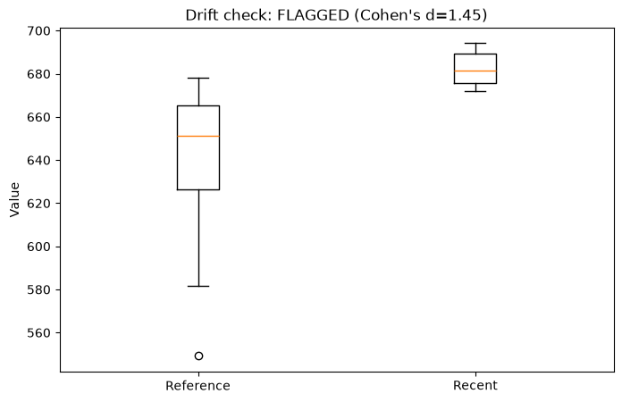
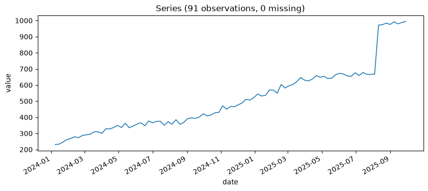
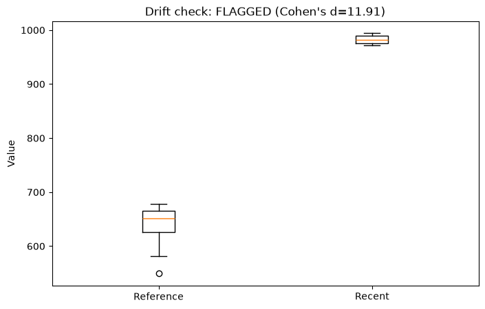
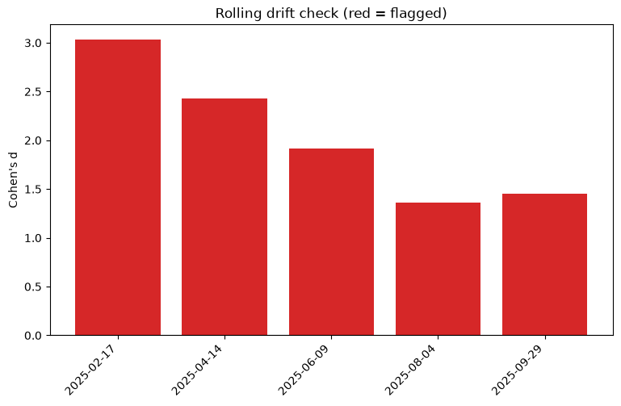
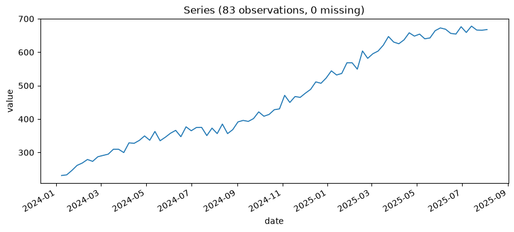

# Chapter 17: When to Sound the Alarm — Drift Detection and Its Blind Spots

Interpol Attention Level is a weekly "heat" index the Secret Lab™ tracks about its own operation — how much scrutiny the world's law enforcement agencies are currently paying it. Ambition being what it is, this number has been climbing, steadily, for nearly two years, entirely on its own, with no single incident behind the climb. That ordinary fact turns out to be exactly the shape that exposes a real blind spot in `detect_data_drift`.

**Prompt:**
> Load the Interpol attention series and give me the basics.

**What Comes Back** (a real result, 91 weeks):

```json
{
  "n_observations": 91,
  "start_date": "2024-01-08",
  "end_date": "2025-09-29",
  "inferred_frequency": "W-MON",
  "n_missing_values": 0,
  "mean": 483.251,
  "mean_ci_lower": 452.321,
  "mean_ci_upper": 514.181,
  "confidence_level": 0.95,
  "std": 148.515,
  "min": 231.045,
  "max": 694.115
}
```

Nearly two years of weekly readings, no gaps, climbing from a minimum around 231 to a maximum around 694 — already a strong hint of the trend the rest of this chapter is built around. Seen directly, rather than inferred from a min/max spread:



An ordinary, unbroken climb — no visible jump, no single day that looks like an incident. That's worth holding onto going into the next section: everything that follows about this series being flagged as "drift" is being flagged on exactly this shape, nothing more dramatic than steady, expected growth.

## An Ordinary Trend, Flagged as Drift

**Prompt:**
> Check the Interpol attention series for drift. Is the flag driven by a genuine regime change, or could it just be the ongoing trend?

**What Comes Back** (a real result — 8-week recent window against a 26-week reference window, on the unmodified, steadily-trending series):

```json
{
  "mean_shift_pct": 6.484,
  "ttest_p_value": 0.0,
  "mean_shift_cohens_d": 1.4499,
  "ks_statistic": 0.8846,
  "drift_detected": true,
  "interpretation": "At least one test flags a significant distributional shift... Check by eye whether this lines up with a known seasonal transition or an ongoing trend (both plausible false positives for this test)..."
}
```

**What It Means:** Two independent tests feed `drift_detected` here, and it's worth knowing what each one actually checks. `ttest_p_value` asks a narrow question — has the *mean* shifted between the two windows. `ks_statistic` comes from the **Kolmogorov-Smirnov test**, a second, broader check on the same underlying question — do these two windows' values actually come from different distributions — using each window's whole shape, not just its average. `0.8846` (on a `0` to `1` scale, where `0` means identical distributions) is about as decisive as this test gets, and it's checking something the t-test alone can't: a mean could stay put while a distribution's spread or shape still shifted underneath it, and the KS statistic would catch that where the t-test wouldn't.

`drift_detected: true`, and — worth pausing on this — `mean_shift_cohens_d: 1.45` isn't a marginal effect size. By the conventional textbook bins (small ≈ 0.2, medium ≈ 0.5, large ≈ 0.8), `1.45` is comfortably **large**. This is worth being honest about, because it complicates a tempting assumption: that an ordinary, well-understood trend should only ever produce a small, easily-dismissed effect size, while a real problem produces a large one. That assumption is false, demonstrated with real numbers, on real data. A perfectly ordinary, fully-expected trend — nothing anomalous about it at all — can by itself produce a large Cohen's d. The effect size here is doing exactly what it's supposed to: correctly reporting that these two windows really are quite different from each other. It says nothing about *why* they're different, and "why" is precisely the judgment call this book keeps insisting a human or agent make, not the test.

**What Comes Back** (a real render, `ts-monitor__plot_drift` on the same unmodified series and windows):



**What It Means:** The two distributions really do look different — recent values sit visibly higher than the reference ones, no overlap trick or squinting required. That's real, and it's real precisely *because* it's just a trend continuing, which is the whole point this chapter is building toward: a picture this clean can still be describing something entirely mundane.

## The Real Contrast That Actually Distinguishes Them

If ordinary trend alone produces a large effect size, what does an actual incident look like by comparison? A believable one: a botched heist becomes public, and Interpol's attention spikes hard over the following two months, on top of the trend that was already there.

**Prompt:**
> Load the escalation version of the series -- the one with the real incident added -- and give me the basics.

**What Comes Back** (a real result, same 91 weeks, only the final 8 changed):

```json
{
  "n_observations": 91,
  "start_date": "2024-01-08",
  "end_date": "2025-09-29",
  "inferred_frequency": "W-MON",
  "n_missing_values": 0,
  "mean": 509.625,
  "mean_ci_lower": 467.982,
  "mean_ci_upper": 551.268,
  "confidence_level": 0.95,
  "std": 199.957,
  "min": 231.045,
  "max": 994.115
}
```

Same start, same minimum — but the maximum jumped from 694 to 994, and the overall spread (`std`) grew by a third. Seen directly:



Compare this against the plain series' plot a moment ago: the same steady climb for most of the series, then a real, visible step up right at the end — exactly the shape a genuine incident riding on top of an ongoing trend should look like, and visually distinct from the plain trend's smooth, uninterrupted climb.

**What Comes Back** (a real result, the same 8-vs-26-week check, on a version of the series with a flat `+300` shift added to its most recent 8 weeks):

```json
{"mean_shift_pct": 53.287, "mean_shift_cohens_d": 11.9146, "ks_statistic": 1.0, "drift_detected": true}
```

**What It Means:** `11.91`, against the plain trend's `1.45` — nearly an **eight-fold** jump, both nominally "large" by the same textbook bins that already called the boring trend large. This is the actual lesson, sharper than the outline originally planned: effect size doesn't cleanly sort into "boring" and "alarming" using a fixed cutoff table borrowed from a statistics textbook. What it *does* do is give you a genuine magnitude scale — and reading it comparatively, against what this specific series' own ordinary behavior already produces, tells you far more than checking whether it clears some universal threshold. `1.45` being this series' new normal, `11.91` is not.

**What Comes Back** (the same `plot_drift` render, on the escalation-shifted series):



**What It Means:** Set this next to the plain trend's plot above and the difference is immediate — the earlier pair had a real but modest gap between two still-overlapping distributions; this pair barely touches. That visual gap is the `1.45`-versus-`11.91` finding made physical, and it's exactly the kind of side-by-side comparison a bare `drift_detected: true` boolean, shown once, could never communicate — you need to have seen what "ordinary" looks like on this same series first, which is why both images exist together rather than either one alone.

## Distinguishing a Blip from Something Sustained — With a Real Limit of Its Own

**Prompt:**
> Run a rolling drift check across several windows on the plain, unmodified series. Does the shift show up consistently, or only once?

**What Comes Back** (a real result, five non-overlapping checks walking backward through the unmodified trending series):

```json
{
  "checks": [
    {"recent_window_end_date": "2025-02-17", "mean_shift_cohens_d": 3.0341},
    {"recent_window_end_date": "2025-04-14", "mean_shift_cohens_d": 2.4297},
    {"recent_window_end_date": "2025-06-09", "mean_shift_cohens_d": 1.9178},
    {"recent_window_end_date": "2025-08-04", "mean_shift_cohens_d": 1.358},
    {"recent_window_end_date": "2025-09-29", "mean_shift_cohens_d": 1.4499}
  ],
  "n_flagged": 5, "frac_flagged": 1.0, "persistent_drift": true,
  "interpretation": "5/5 rolling checks flagged drift... looks like a SUSTAINED shift, not a one-off blip."
}
```

**What It Means:** This is the right conclusion, and it's arrived at correctly — "persistent" is exactly what an ongoing trend genuinely is, month after month, not a false alarm. But run the identical check on the *escalation*-shifted version of the series, and something worth noticing happens: the first four checks come back **numerically identical** (`3.03`, `2.43`, `1.92`, `1.36` — none of them touch the shifted weeks at all), and only the final, most-recent check jumps to `11.91`. `n_flagged` is `5/5` either way — `persistent_drift: true` in both cases, because the ordinary trend alone was already enough to trip every single window, before any incident happened at all. The binary persistence verdict, read alone, cannot tell these two series apart. What can is the per-check *trajectory* sitting right next to it: four checks holding steady in a familiar range, then one sudden, sharp break from the pattern. `rolling_drift_check`'s real value here turned out to be different from — and arguably more useful than — the single persistent-vs-isolated question it was built to answer: read alongside its own per-check detail, it can localize *roughly when* something new started, layered on top of a trend that was already going to trip the alarm regardless.

**Prompt:**
> Plot the rolling drift check's per-window trajectory on the plain series.

**What Comes Back** (a real render, `ts-monitor__plot_rolling_drift` on the five checks above):



**What It Means:** This is the plot the previous paragraph's argument actually needed — five bars, all past the flagged threshold, gently declining rather than climbing. On this unmodified series that's the whole story: no bar breaks from the pattern the way the escalation-series version would (not shown here, but easy to predict from the numbers already given: four bars in this same declining range, then one sharp jump). That contrast — a smooth trajectory versus one that suddenly isn't — is exactly the kind of shape a reader can register in half a second from a bar chart and would have to reconstruct by hand from five separate JSON numbers otherwise.

## Turning This Into a Decision

**Prompt:**
> Given everything above — real degradation, real drift — what does `recommend_retraining` actually suggest doing next?

A real deployed model exists for this series: ETS, backtested on the first 83 weeks at `2.40%` MAPE. Worth loading that exact training history before trusting the number:

**What Comes Back** (a real result, 83 weeks — everything before the real escalation happened):

```json
{
  "n_observations": 83,
  "start_date": "2024-01-08",
  "end_date": "2025-08-04",
  "inferred_frequency": "W-MON",
  "n_missing_values": 0,
  "mean": 464.042,
  "mean_ci_lower": 433.197,
  "mean_ci_upper": 494.886,
  "confidence_level": 0.95,
  "std": 141.259,
  "min": 231.045,
  "max": 678.038
}
```



The last 8 weeks — the ones containing the real escalation — are deliberately absent from both this JSON and this plot: this is exactly what a model deployed *before* the incident happened would actually have been backtested and trained against, nothing more. Checked against the 8 weeks that include the real escalation:

```json
{
  "mape_now": 31.6667, "mape_backtest": 2.4016, "pct_degradation": 1218.57,
  "drift_detected": true,
  "interval_coverage": {"empirical_coverage_pct": 0.0},
  "recommendation": "retrain_now",
  "reasoning": "Forecast error has degraded beyond threshold AND the data shows a distributional shift -- both signals point the same direction."
}
```

**What It Means:** Every signal agrees, decisively — a `1,218%` relative degradation, `0%` interval coverage, confirmed drift. `retrain_now` is the obviously correct call here, and it's worth seeing what an unambiguous case looks like before looking at one that isn't.

**A Deliberately Constructed Close Call.** This series' real numbers never produced the borderline case `recommend_retraining`'s own docstring warns about, so here's one built specifically to show it, clearly labeled as constructed rather than pulled from Interpol's real data: a backtest MAPE of `10.0%`, a current MAPE of `11.5%` (`15%` relative degradation — under the default `20%` threshold), with a real bootstrap CI of `[5%, 25%]` around that current estimate.

```json
{
  "pct_degradation": 15.0, "degradation_threshold_within_ci": true,
  "recommendation": "no_action_needed",
  "reasoning": "Forecast error is within tolerance... Note: mape_now's bootstrap CI ([5.0%, 25.0%] implied degradation) straddles the 20.0% threshold -- this degraded/not-degraded verdict is sensitive to sampling noise in mape_now, not a clear-cut case."
}
```

**What It Means:** The verdict is still `no_action_needed` — the point estimate sits under the threshold, and the function has to return *something* deterministic. But the reasoning attached to it doesn't pretend this was a clean call. The CI genuinely straddles the exact line the recommendation was decided on; a slightly different holdout could easily have pushed `mape_now` past `20%` and flipped the verdict to `investigate`. Treating this recommendation with the same confidence as the Interpol series' unambiguous `retrain_now` above would be a mistake — this one is close, and the tool says so explicitly rather than manufacturing false confidence around a threshold that sampling noise could move either direction.

## What's Next

Every layer through `ts-monitor` now has a real, tested voice in this decision — degradation, drift, calibration, all pointing, in this chapter's real case, the same direction. Part V closes the loop: Chapter 18 takes `recommend_retraining`'s output and asks what happens next, with the deployment decision itself now sitting behind a deterministic gate rather than an agent's unchecked judgment call.
