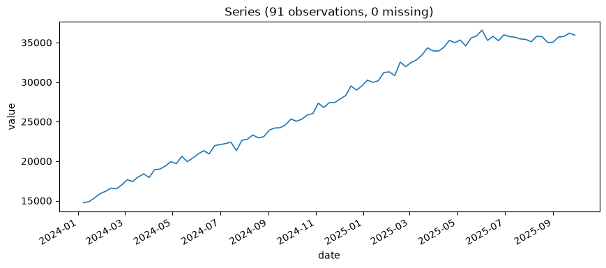

# Chapter 18: Should You Even Redeploy? — Deterministic Gates and Confidence-Aware Comparisons

A rival supervillain has entered the death-ray rental market, undercutting prices aggressively. Death-Ray Revenue's once-reliable climb has genuinely flattened over the last several months — this isn't noise, it's real competitive pressure, and `ts-monitor` would have every reason to flag it. The question this chapter answers isn't "has something changed" — that part's assumed. It's the next one: given a freshly retrained candidate model, is it actually worth the disruption of redeploying? Part V's tool for that question, `ts-retrain__compare_candidate_to_deployed`, answers it the same way every time, with no room for an agent to talk itself into either side.

## Why This Is a Rule, Not a Judgment Call

Every deterministic gate in this book so far — `recommend_retraining`'s four verdicts, `execute_redeploy`'s `confirmed=True` requirement — exists for the same reason Chapter 1 named on page one: consequential actions get deterministic gates, open-ended reasoning gets agent judgment. "Should we redeploy" sits squarely on the consequential side. Redeploying isn't free — it resets `ts-monitor`'s baseline, restarts the clock on calibration checks that need real elapsed time to mean anything (Chapter 16's Wilson score intervals were already wide at 10 days; every redeploy starts that clock over), and swaps a model whose behavior in production is at least partially known for one that isn't yet. An agent asked "does this candidate look better" in freeform judgment could talk itself into redeploying on a coin-flip-sized improvement, especially with a plausible-sounding rival-supervillain story attached to justify it. A fixed threshold, applied the same way regardless of how compelling the narrative sounds, can't be talked into anything.

## Read the Deployment Record Before Comparing Anything

Before retraining a candidate at all, it's worth asking a more basic question first: what does the manifest actually say is deployed right now, rather than trusting memory of an earlier chapter's result.

**Prompt:**
> Before retraining anything, show me what's currently recorded as deployed for the death-ray revenue series.

**What Comes Back** (a real result, read back from the manifest `ts-retrain__record_deployment` wrote after Chapter 9's ETS(add, mul, 7) fit):

```json
{
  "model": "ets",
  "params": {"trend": "add", "seasonal": "mul", "seasonal_period": 7, "damped_trend": false},
  "backtest_metrics": {
    "mape_pct": 5.5511, "mape_pct_ci_lower": 4.699, "mape_pct_ci_upper": 6.5239
  },
  "horizon": 30
}
```

**What It Means:** `ts-retrain__load_deployment_manifest` does no comparison and no judgment of its own — it just answers "what's actually on file," which is exactly the kind of question worth asking directly instead of assuming. This confirms the deployed model really is Chapter 9's ETS(add, mul, 7) fit, at the same `5.5511%` MAPE this chapter is about to compare candidates against — not a stale or misremembered number. Skipping this step and just trusting "I think ETS is still deployed" is precisely the kind of unverified assumption this book has warned against since Chapter 1; here, the state to verify happens to live in a small JSON file instead of a statistical estimate, but the discipline is the same one.

## The Real Retrain, and a Genuinely Honest Answer

**Prompt:**
> Load the death-ray revenue series extended through the rival's price war, and give me the basics before retraining anything.

**What Comes Back** (a real result, 91 weeks — Chapter 4's original 70 weeks plus 21 more covering the price war):

```json
{
  "n_observations": 91,
  "start_date": "2024-01-08",
  "end_date": "2025-09-29",
  "inferred_frequency": "W-MON",
  "n_missing_values": 0,
  "mean": 27215.625,
  "mean_ci_lower": 25758.043,
  "mean_ci_upper": 28673.206,
  "confidence_level": 0.95,
  "std": 6998.851,
  "min": 14739.478,
  "max": 36572.074
}
```

Same starting point as Chapter 4's series, 21 more weeks tacked on the end. The mean and max both crept up from Chapter 4's numbers, which alone doesn't say whether growth is continuing normally or actually slowing:



Compare this directly against Chapter 4's own plot: the same steep climb for the first 70 weeks, then a visibly flatter slope over the final stretch — the rival's price war, seen directly rather than inferred from a monitoring alert. That flattening is exactly what the rest of this chapter is about deciding what to do with.

**Prompt:**
> Retrain ETS on the extended series, now that rival competition has flattened growth. Does it clear the redeploy threshold against what's currently deployed?

The currently-deployed model is real: the same ETS(add, mul, 7) configuration Chapter 9 found well-calibrated and Chapter 15's DM-test search confirmed as the outright winner against every other real candidate — refit fresh here to get precise current numbers for the deployment record, `record_deployment` at `5.5511%` MAPE (CI `[4.699, 6.5239]`).

**What Comes Back** (a real result — the same ETS configuration, freshly refit on the series extended through the rival's price war):

```json
{
  "candidate_value": 5.6156, "deployed_value": 5.5511,
  "pct_improvement": -1.16,
  "pct_improvement_ci_lower": -57.84, "pct_improvement_ci_upper": 41.54,
  "deployed_metrics_ci_used": true,
  "should_redeploy": false,
  "reasoning": "Candidate's mape_pct (5.6156) is not better than the deployed model's (5.5511) -- keep the current deployment. Retraining alone didn't fix whatever ts-monitor flagged; that's worth investigating further (e.g. a genuine regime change may need a different model family or feature set, not just refreshed parameters of the same one)."
}
```

**What It Means:** Simply refitting the *same* model configuration on newer data — the reflexive first move — didn't help. MAPE actually got very slightly worse. The candidate's own interval coverage (not shown above, but real: `50.0%` against a `95%` nominal target) came back badly miscalibrated too, a sign this ETS configuration is genuinely struggling with the new, flatter-trend regime, not just unlucky on one backtest. The tool's own generated reasoning names the likely reason directly: retraining the same architecture on data containing a real structural break doesn't automatically produce a model that's learned the break — sometimes the fix is a different model family, not fresher parameters of the old one.

**Trying a different family, honestly:**

```json
{
  "candidate_value": 5.3808, "deployed_value": 5.5511,
  "pct_improvement": 3.07,
  "pct_improvement_ci_lower": -50.65, "pct_improvement_ci_upper": 43.1,
  "should_redeploy": false,
  "reasoning": "Candidate's mape_pct (5.3808) is marginally better than deployed (5.5511, 3.07% improvement) but below the 10.0% threshold -- not enough to justify redeploying and resetting the monitoring baseline."
}
```

**What It Means:** SARIMA(1,1,2), refit on the same extended series, does genuinely edge out the deployed model — `5.38%` versus `5.55%`, a real, if modest, `3.07%` relative improvement. And the gate still says no. This is the design working exactly as intended, not a false negative: the default `10%` threshold exists specifically to reject improvements this small. A `3%` gain doesn't clear the bar of "worth the redeploy disruption," and the tool doesn't pretend otherwise just because the number technically points the right direction. Chasing every small, possibly-noise-level improvement is exactly the churn this threshold was built to prevent — redeploying, resetting the monitoring baseline, and doing it all again next week the moment some other marginal candidate edges ahead by a point.

## The Arithmetic, Verified Exactly

Both real comparisons above flagged `redeploy_threshold_within_ci: true` — worth understanding precisely what that combination is doing, with a clean, hand-checkable case rather than the noisier real numbers above. This exact example lives in this project's own test suite, verified here directly against the live tool.

**Candidate alone has a CI** (`6.0%`, `[5.0, 7.0]`) **against a fixed deployed value** (`10.0%`):

```json
{"pct_improvement": 40.0, "pct_improvement_ci_lower": 30.0, "pct_improvement_ci_upper": 50.0, "deployed_metrics_ci_used": false}
```

**Both sides have a CI** (deployed now `10.0%`, `[9.0, 11.0]`):

```json
{"pct_improvement": 40.0, "pct_improvement_ci_lower": 22.22, "pct_improvement_ci_upper": 54.55, "deployed_metrics_ci_used": true}
```

**What It Means:** Folding in the deployed model's own uncertainty widened the range on *both* ends — down from `30%` to `22.22%`, up from `50%` to `54.55%`. This is exactly why it's interval arithmetic, not Chapter 15's variance-addition shortcut. `pct_improvement = 100×(deployed − candidate)/deployed` is a **ratio**, not a sum — it increases in `deployed` and decreases in `candidate`, so its true worst case pairs the candidate's *highest* plausible value with the deployed model's *lowest* (`100×(9−7)/9 = 22.22%`), and its best case pairs the candidate's lowest with the deployed model's highest (`100×(11−5)/11 = 54.55%`) — the two corners of the uncertainty box that actually produce the extremes of a ratio, not a symmetric combination of the two component widths the way Chapter 15's independent-variance formula was. Get the corners wrong — pairing lowest-with-lowest instead — and the reported range wouldn't bound the ratio's real extremes at all.

## What's Next

Every real comparison this chapter ran came back `should_redeploy: false` — not because nothing had changed (something clearly had), but because neither retrained candidate cleared a bar deliberately set above "technically better." That's the deterministic gate functioning exactly as designed, even under real competitive pressure with a real, honest story behind it. Chapter 19 looks at the other kind of gate in this layer — `execute_redeploy`'s `confirmed=True` requirement — and the narrower, carefully-scoped conditions under which it can be trusted to act without a human in the loop at all.
